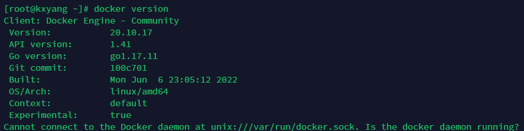
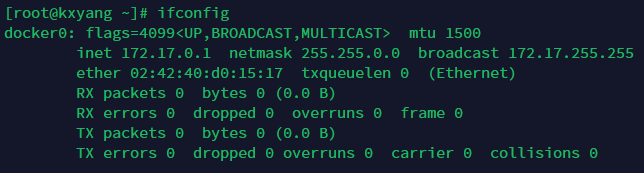
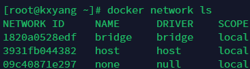
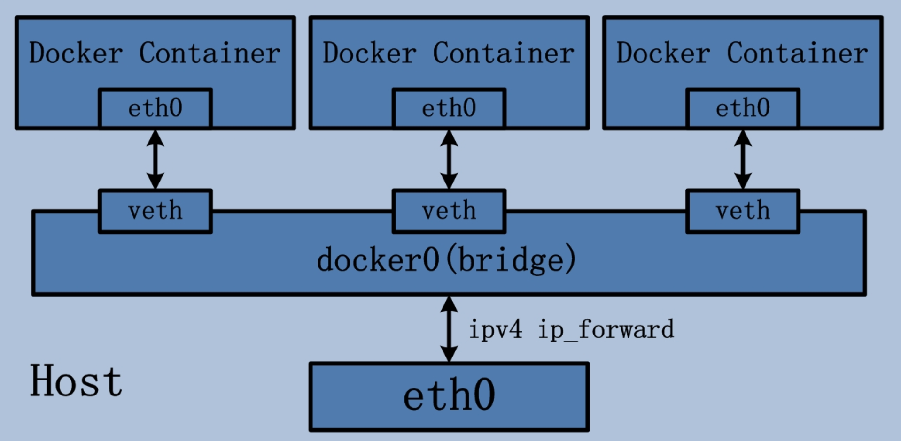
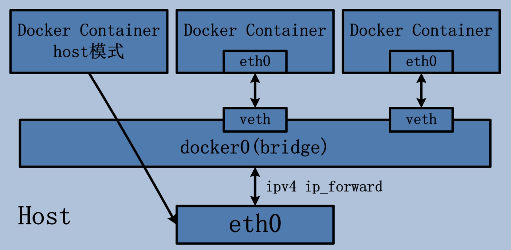
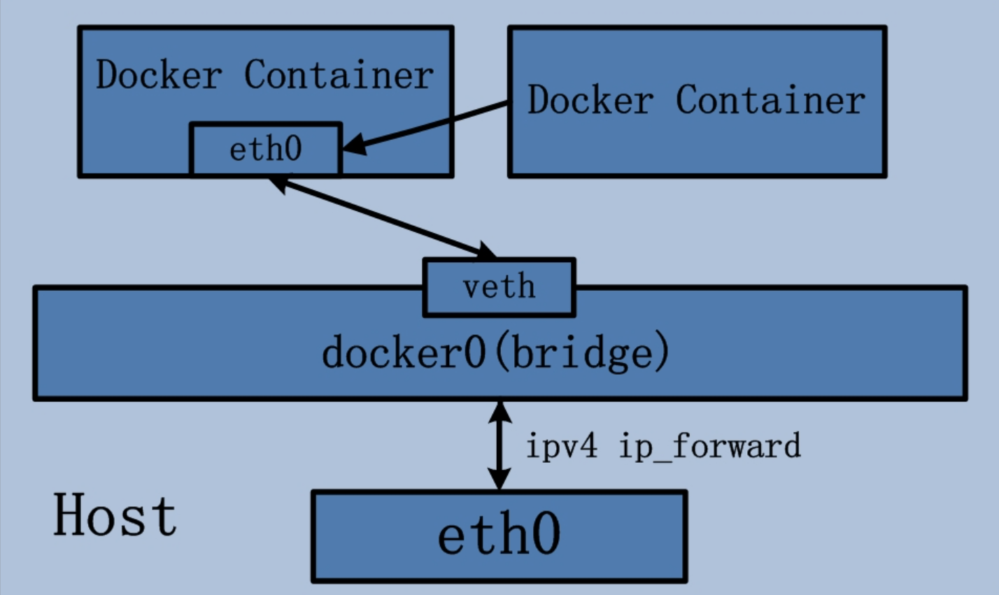

# docker


## # 安装docker

- 卸载原有docker

```bash
 sudo yum remove docker \
                  docker-client \
                  docker-client-latest \
                  docker-common \
                  docker-latest \
                  docker-latest-logrotate \
                  docker-logrotate \
                  docker-engine
```

- 设置yum资源库

> yum-utils，这是一个与 yum 集成的实用程序集合，可以通过多种方式扩展 yum 的自带功能，从而使 yum 更强大、更易于使用。
>
> yum-config-manager 命令的本质是对`/etc/yum.repos.d/`（库数据的储存位置）文件夹下文件的增删查改

```bash
 sudo yum install -y yum-utils
 sudo yum-config-manager \
    --add-repo \
    https://download.docker.com/linux/centos/docker-ce.repo
```

- 安装Docker Engine

```bash
 sudo yum install docker-ce docker-ce-cli containerd.io docker-compose-plugin
```

- 检测是否安装成功

```bash
docker version
```



## # 单应用docker

### 构建Dockerfile

```dockerfile
FROM node:版本号 # 指定base image
RUN addgroup app && adduser -S -G app app	# 创建系统将要使用的用户组
USER app	# 使用创建的系统用户，以后的操作均由app用户
WORKDIR /App	# 设置当前工作目录
RUN mkdir data	# 以app用户来创建data目录
[ADD]				# 与COPY相同，但是可以从URL或.zip压缩包添加 
COPY package* .	# 先复制用于npm isntall的文件
RUN npm install		# 执行构造完环境后所要执行的命令
COPY . .	# 复制当前文件夹的所有内容到 image 的 /app/ 下，若不存在则创建；若设置了workdir，则可使用相对路径
RUN ...				# Linux下常用命令等
ENV API_URL=http://api.myapp.com/	# 添加需要的环境变量
EXPOSE 3000		# 容器将要监听的端口
CMD ["npm", "start"]	# 启动容器时所要执行的命令，一个dockerfile只能有一个CMD
ENTRYPOINT ["npm", "start"]	# 入口点，与CMD类似但不能轻易在bash中覆写
# RUN命令是在构建镜像时执行的，会产生新的层
# CMD命令是在启动容器时执行的，对镜像没有影响
# 一般还是会用entrypoint的中括号形式作为 docker 容器启动以后的默认执行命令，里面放的是不变的部分。
# 可变部分比如命令参数可以使用cmd的形式提供默认版本，也就是run里面没有任何参数时使用的默认参数。如果我们想用默认参数，就直接run，否则想用其他参数，就run 里面加参数。
```

​	如果需要排除某些文件，使用[.dockerignore]文件来排除

```dockerfile
# .dockerignore
node_modules/
```

​	使用build命令来构建镜像

```bash
docker build -t imagename:1.3.5 .
```

### image操作

```bash
docker container prune # 取出所有停止的容器，所有停止状态的容器会被删除

docker image prune # 清理none镜像

docker image rm imagename[imageid] # 删除镜像

docker image tag imagename:tag[imageid] imagename:newtag # 重命名image

docker image save -o saveFileName imagename # 在当前文件夹保存进行

docker image load -i loadFileName	# 加载本地image镜像
```

### 从image到dockerhub

- 对image重命名

```bash
docker image tag imagename:tag[imageid] dockerhubname/imagename:newtag
```

- 登录dockerhub

```bash
docker login
```

- push镜像

```bash
docker push imagename
```

### 容器操作

```bash
docker run imagename	# 启动名为imagename的容器
		-d					# 分离模式运行，在后台运行
		--name				# 给容器命名
		-p					# 端口映射		容器端口：本地端口
		-it					# 以交互模式启动容器
		-v					# 挂载本地卷		容器内路径： 容器内路径，本地内容会覆盖容器内容
		
docker logs containerId[Name]		# 查看容器工作日志
		-f								# 实时跟踪容器日志
		-n								# 指定查看日志的数量，倒序
		-t								# 加时间戳
		
docker exec -it containerId[Name]		# 在新的命令行以交互模式进入容器

docker stop containderId[Name]			# 停止一个容器

docker start containerId[Nmae]			# 重启一个容器

docker rm containerId[Nmae]			# 移除一个容器
		-f								# 强制移除
```

- 数据持久化：卷存储

```bash
docker volume create volname		# 创建一个新卷

docker volume inspect volname				# 查看卷

docker cp containerId:filePath localPath	# 复制容器文件到本地
docker cp localPath containerId:filePath	# 复制本地文件到容器
```

## # 多应用docker

### Docker Compose

- 安装dockerCompose

[Install Docker Compose CLI plugin](https://docs.docker.com/compose/install/compose-plugin/)

### docker-compose.yml

```yaml
version: "3.8"		# 设置compose版本
services: 			# 设置应用程序的构建块和服务
	web:
		build: ./frontend		# 设置构建路径
		ports:					# 设置端口映射
			- 3000:3000			
	api:
		bulid: ./backend
		ports:
			- 3001:3001
		environment:			# 设置环境变量
			- DB_URL=mongodb://db/vidly
		volumes:
			- ./backend:/app
		command: 。/wait-for db:27017 && migrate-mongo up && npm start	
				# 覆盖默认命令, ./wait-for是一个shell脚本，等等db容器的27017端口开放后再进行之后的语句
				# 可以用shell脚本
	db:
		image: mongo:4.0-xenial
		ports:
			- 27017:27017+
		volumes:
			- vidly: /data/db		# 挂载卷
volumes:	# 定义卷地址
	vidly:
```

​	使用build命令构建compose

```bash
docker-compose bulid
```

### 	compose操作

```bash
docker-compose up		# 启动docker组
		-d					# 后台运行

docker-compose ps		# 查看当前运行的docker组

docker-compose down		# 停止docker组

docker-compose logs		# 查看容器组工作日志
		-f								# 实时跟踪容器组日志
		-n								# 指定查看日志的数量，倒序
		-t								# 加时间戳
```


## # docker网络

> ​	docker自带DNS服务器，包含了容器的名字和IP；在每一个容器中，都有一个DNS解析器的组件，DNS解析器和DNS服务器对话，找到目标容器的IP

​	启动docker后，会生成一个虚拟网桥docker0，docker就是使用docker0网桥来进行容器与宿主机、容器与容器的通信。



​	安装docker后，默认会自动创建三个网络bridge、host、none



### 网络模式

|  bridge   | 为每一个容器分配、设置IP等，并将容器连接到docker0虚拟网桥，默认为bridge模式 |
| :-------: | :----------------------------------------------------------- |
|   host    | 容器不会虚拟出自己的网卡、配置自己的IP，而是使用宿主机的内容 |
|   none    | 容器有独立的Network namespace，但并没有对其进行任何网络设置  |
| container | 新创建的容器使用另一个容器共享IP和端口                       |

- bridge



- host



- container



### 自定义网络

> 实现容器与容器通信

​	使用默认docker网络则无法实现使用容器名进行通信，自定义网络可以解决只能与固定ip地址通信的问题，会使用docker自带的DNS服务器进行容器名和ip的映射

```bash
docker network create netName		# 创建一个自定义网络
docker run ... --network netName ...	# 将服务加入自定义网络
```


## # 自动化测试

## # docker部署

### 集群部署

​	基于k8s(Kubernetes)部署

### 单一部署

- 减小docker镜像体积

​	使用[npm build]命令构建出静态资源，随后只需布置单独的docker文件即可

## # docker可视化

> [SimpleDocker](https://gitee.com/taoes_admin/SimpleDocker) 是一个简单的Docker控制面板，致力于可以让用户更方便、更无障碍、更舒适的使用Docker，其界面简洁、操作便捷，功能强大，可以带来更好地运维体验。

### 部署方法

[SimpleDocker#dockercompose-安装](https://gitee.com/taoes_admin/SimpleDocker#dockercompose-安装)

**注意：**进入云服务器控制台，开放服务器9091端口

