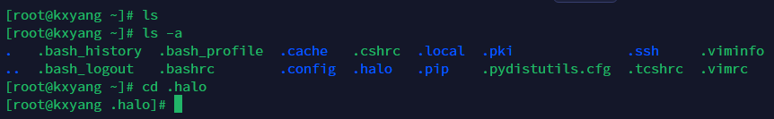
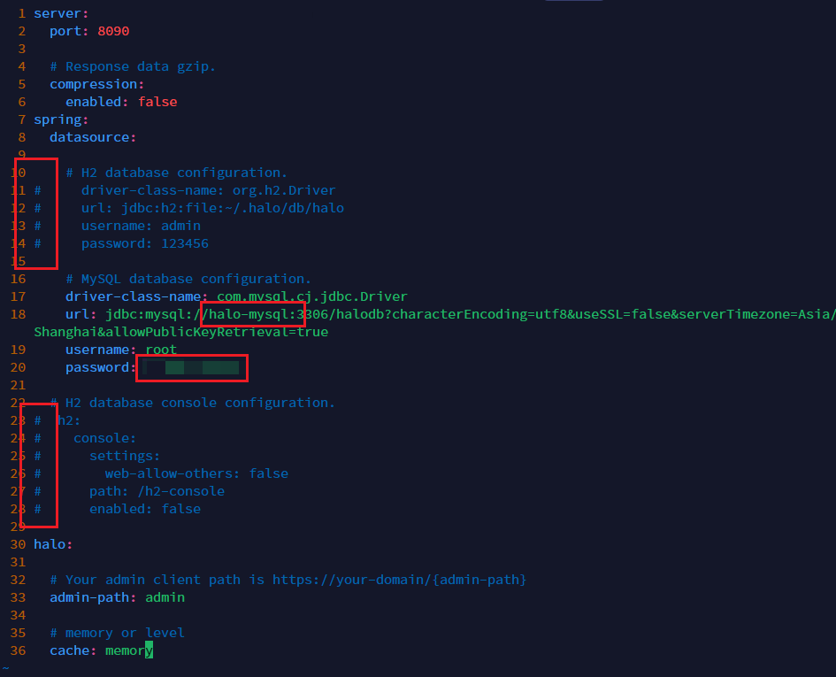
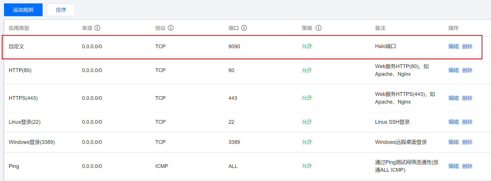
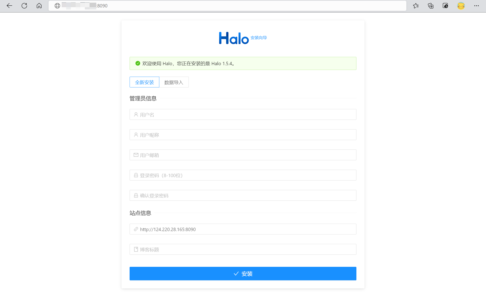

## # Mysql-docker部署

### 创建 Docker 自定义桥接网络

​	为了让Halo和Mysql可以相互通信，因此需要将两者放置在同一个网络中

```bash
docker network create halo-net		# 创建一个名为halo-net的网络
```

### 拉取 MySQL 镜像

```bash
docker pull mysql:8.0.27			# 拉取8.0.27版本的mysql
```

### 创建 MySQL 数据目录

```bash
mkdir -p ~/.halo/mysql
# 在用户目录下创建.halo/mysql目录，其中.halo目录会自动隐藏，使用 ls -a可以看到
```



### 启动 MySQL 实例

```bash
docker run
	--name halo-mysql		# 容器命名
	-v ~/.halo/mysql:/var/lib/mysql		# 挂载卷
	-e MYSQL_ROOT_PASSWORD=password		# 设置Mysql密码
	--net halo-net			# 设置网络
	--restart=unless-stopped	# 设置重启模式
	-d		# 后台运行  
	mysql:8.0.27	# 启动镜像
```

### 进入 MySQL 中创建 Halo 需要的数据库

- 进入 Mysql 容器

```bash
docker exec -it some-mysql /bin/bash	# 以命令行交互模式进入容器
```

- 登录 Mysql

```bash
mysql -u root -p password
```

- 创建数据库

```mysql
create database halodb character set utf8mb4 collate utf8mb4_bin;
```

- 退出容器

## # Halo-docker部署

### 进入Halo工作目录

```bash
cd ~/.halo
```

### 下载配置文件到工作目录

```bash
wget https://dl.halo.run/config/application-template.yaml
	-O ./application.yaml	# 下载并以不同的文件名保存
```

### 编辑配置文件，配置数据库

​	[配置参考 | Halo Documents](https://docs.halo.run/getting-started/config/)

- 注释 H2 database configuration.部分
- 启用 MySQL database configuration.部分
- 修改 datasource 下的 url 中的 ip 地址部分为容器名称并修改密码



### 启动 Halo 实例

```bash
docker run
	-it
	-d
	--name halo
	-p 8090:8090 
	-v ~/.halo:/root/.halo
	--net halo-net
	--restart=unless-stopped
	halohub/halo:1.5.4
```

### 开放8090端口

​	进入云服务器控制台，开放服务器8090端口



6. 测试访问

> http://公网ip:8090/


