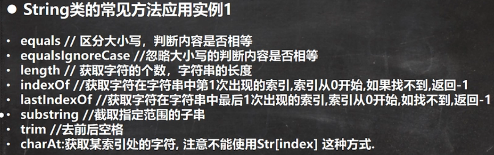
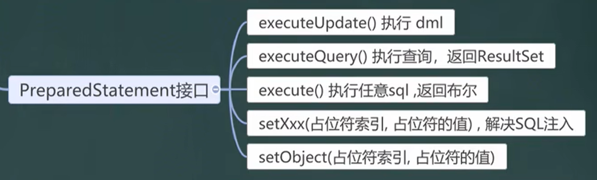
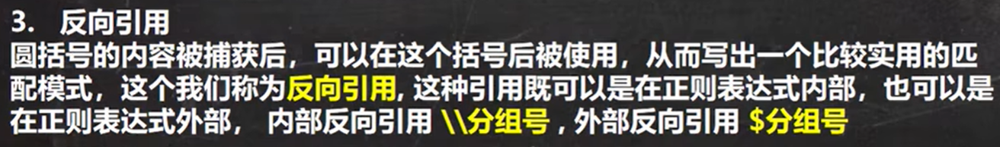

##  # Java运行本质及机制

- [.java] -> [.class] -- JVM -- result

  - .java  java源文件

  - .class 字节码文件

  - 执行的本质就是.class文件装载到JVM内执行

  - 一个.java文件最多一个public类，其他类不限，文件名与public类名相同

> JDK(Java Development Kit) Java开发工具包
>
> JDK = JRE + java开发工具集
>
> JRE(Java Runtime Environment) Java运行环境
>
> JRE = JVM + Java标准类库

1. JVM，Java虚拟机，具有指令集，负责执行指令、管理数据、内存、寄存器，包含在JDK中

2. 对于不同的平台有不同的虚拟机

3. JVM机制屏蔽了底层运行平台的差别，实现了 **一次编译，到处运行** 的模式

4. JDK是提供给Java开发人员使用的，包含了Java开发工具，包括了JRE
5. 如果想要运行一个Java程序，只需安装JRE

## # Java基础

### 转义字符

- \t  [制表位]
- \n  [换行符]
- \\\  [\\]
- \\'  [']
- \r  [回车]: 光标直接回到此行最前面

### 注释

- 单行注释 

```java
// 这是单行注释
```

- 多行注释

```JAVA
/*
这是
多行
注释
*/
```

- 文档注释

​	[Java 文档注释](https://www.runoob.com/java/java-documentation.html)：javadoc标签，可以被JDK提供的javadock所解析，生成一套以网页文件形式体现的该程序的说明文档

```java
/**
* @author kxy
* @version 1.0
*/

//添加完javadoc标签后，使用
// javadoc -d 文件夹名 -author -version xxx.java
// 生成一套网页文件的说明文档
```

### 变量

- 变量是程序的基本组成单位，三个基本要素：类型 + 名称 + 值
- 必须先声明，后使用
- 变量在同一作用域不能重复声明

- [+] 的使用
  - 按照从左往右的顺序计算
  - 都是数值类型时，做数学运算
  - 当有一侧为字符类型时，做拼接运算

#### 数据类型

- 基本数据类型

  - 数值型

    - 整数类型：

      - byte[1]: -128 ~ 127
      - short[2]: -(2 ** 15) ~ [(2 ** 15) - 1] === -32768 ~ 32767
      - int[4]： -(2 ** 31) ~ [(2 ** 31) - 1] === -2147483648 ~ 2147483647
      - long[8]： -(2 ** 63) ~ [(2 ** 63) - 1]

      > long类型使用时，值后要加 [l] 或 [L]

    - 浮点数类型：

      - float[4]：-3.403e38 ~ 3.403e38 ---> 保留小数点后7位

      > float类型使用时，值后要加 [f] 或 [F]

      - double[8]：-1.798e308 ~ 1.798e308

  - 字符类型：char[2]

  > 必须用 ['']，[""]表示字符串
  >
  > 在java中，char类型的本质是一个整数，表示的是unicode对应的字符

  - 布尔类型：boolean[1]

  > 不可以用 0 或 非0 的整数代替 false 或 true

- 引用数据类型

  - 类：class
  - 接口：interface
  - 数组：[]

​	**进行浮点数比较时，应该以两个数的差值的绝对值，在某个范围内进行判断**

### 类型转换

#### 自动转换

- 精度小的类型自动转换为精度大的类型

​		char ->      int -> long -> float -> double

​	byte -> short -> int -> long -> float -> double

- 多种类型混合运算，自动转换成容量最大的数据类型，再进行计算
- 精度大转换精度小的会报错，反之会自动转换
- byte, short 不会和 char 自动转换
- **byte, short, char 进行运算时，会先转换为int类型，不管出现几个，只要出现，就转换成int**
- boolean 不参与转换

#### 强制转换

​	使用时要加上强制类型转换符 [()] ，但可能造成精度降低或溢出

- char类型可以保存int的常量值，不能保存int变量值，需要强转

#### 基本类型与String类型

- 基本类型转String
  - (基本类型的值 + "") -> String类型
- String转基本类型

​	需要保证能够转换成String，否则就会抛出异常8

- 通过基本类的包装类调用 parseXX 转换为基本类型
  - Integer.parseInt()
  - Double.parseDouble()
  - Float.parseFloat()
  - Long.parseLong()
  - Byte.parseByte()
  - Boolean.parseBoolean()
  - Short.parseShort()

### 运算符

运算符是一种特殊的符号，用以表示数据的运算

- 算数运算符

  - [+] [-] [*] [++]
  - [/] 除法
    - 整数与整数相除，会截断小数部分
  - [%] 取模
    - 本质 a-a/b*b
- 关系运算符

  - [==] [!=] [<] [>] [<=] [>=]
  - instanceof 检查是否是类的对象
- 逻辑运算符

  - &&：如果第一个条件为false，则第二个条件不会进行判断
  - &：不管第一个是否为false，第二个条件都要进行判断

  - ||：同理
  - |：同理

  - ！：取反
  - ^：逻辑异或，当a和b不同时，为true
- 位运算符
  - &：按位与
  - |：按位或
  - ^：按位异或
  - ~：按位取反
  - 

- 赋值运算符
  - [=]
  - [+=] [*=] ...
- 三元运算符
  - 表达式？结果1：结果3
    - 若为真，结果1
    - 若为假，结果2

### 标识符

- 规则
  - 英文字符 0-9 _ $
  - 数字不可以开头
  - 不可以使用关键字和保留字
  - 区分大小写
  - 不可以包含空格

- 规范
  - 包名：多单词组成时，字母都小写
  - 类名、接口名：多单词组成时，首字母大写
  - 变量名、方法名：驼峰命名
  - 常量名：字母都大写

### 键盘输入

- 步骤
  1. 导包 java.util.*
  2. 实例化对象
  3. 使用对象

```java
import java.util.Scanner
public class Input{
    public static void main(String[] args){
        Scanner myScanner = new Scanner(System.in);
        String name = myScanner.next();	//接收一个字符串
        int age = myScanner.nextInt();	//接收一个整数
        double salary = myScanner.nextDouble();	//接收一个浮点数
    }
}
```

### 进制

- 2进制：以 [0b] 或 [0B] 开头
- 8进制：以 [0] 开头
- 10进制
- 16进制：以 [0x] 或 [0X] 开头

> 最高位符号位0正1负
>
> 正数 原码 = 反码 = 补码
>
> 负数 反码 = 原码 除符号位，其他位取反
>
> 负数 补码 = 反码 + 1
>
> 0的反码和补码都是0
>
> java没有无符号数
>
> 结果看原码

### 流程控制

#### 顺序控制

​	程序从上到下顺序执行

#### 分支控制

- 单分支

```java
if(条件){
    满足则执行
}
```

- 双分支

```java
if(条件){
    满足则执行
}else{
    不满足则执行
}
```

- 多分支

```java
if(条件1){
    满足则执行
}else if(条件2){
    不满足则执行
}else{
    其他情况
}
```

- 嵌套分支：不要超过三层
- switch分支

​	表达式中的返回值必须是[byte] [short] [int] [char] [enum] [String]

```java
switch(表达式){
    case 常量1:
    语句
    break;
    case 常量2:
    语句
    break;
    default:	//没有匹配上的就执行default
    语句
    break;
}
```

#### 循环控制

- for循环

```java
for(初始化; 循环条件; 结束执行){
    循环体
}
```

- while循环

```java
while(循环条件){
    循环体
}
```

- do while循环

```java
do{
    
}while(循环条件)
```

- break：跳出循环
  - break会直接跳出本层循环
- continue：结束本次循环
  - continue只是结束本次的循环，忽略continue下面的语句，然后进行下一次循环

#### 跳转控制

- return
  - 使用在方法，表示跳出所在的方法
  - 使用在main，表示退出程序

### 数组

​	数组可以存放多个同一类型的数据，数组也是一种数据类型，是 **引用类型** ，即：数组就是一组数据

#### 初始化

1. 动态初始化

```java
数据类型 数组名[] = new 数据类型[大小];
int a[] = new int[5];
```

2. 动态初始化：先声明，后分配内存

- 先声明数组

```java
数据类型 数组名[];	数据类型[] 数组名;
int a[];		  int[] a;
```

- 创建数组

```java
数组名 = new 数据类型[大小];
a = new int[10];
```

3. 静态初始化

```
数据类型 数组名[] = {值1, 值2, 值3...}
```

#### 细节

- 数组中的元素可以是任何数据类型，包括基本类型和引用类型，但不能混用
- 数组的默认值
  - int 0
  - short 0
  - byte 0
  - long 0
  - float 0.0
  - double 0.0
  - char \u0000
  - boolean false
  - String null
- 数组属引用类型，数组型数据是对象

> 赋值机制

- 基本数据类型赋值，这个值就是具体的数据，而且相互不影响：值传递/值拷贝

```java
int n1 = 1;
int n2 = n1;
// 此时改变n2的值不改变n1的值，n1和n2是独立的数据
```

- 数组在默认情况下是引用传递，赋的是地址：引用传递/地址拷贝

```java
int[] arr1 = {1, 2, 3}
int[] arr2 = arr1;
// 此时arr2的变化会影响arr1
```

> 数组拷贝

```java
int[] arr2 = new int[arr1.length];	//给arr2开辟新的 堆 空间
for(int i = 0; i < arr1.length; i++){
	arr2[i] = arr1[i];
}
```

> 数组翻转

- 对称交换值
  - arr[i] 与 arr[arr.length -1 -i]
- 逆序赋值

> 数组扩容

- 定义一个[length + 1]的新数组，然后进行拷贝操作
  - 最后要让 arr 指向 arrNew，就回收了原数组

#### 二维数组

##### 初始化

1. 动态初始化

```java
类型[][] 数组名 = new 类型[大小a][大小b] //表示此二维数组有a个大小的一位数组，每个一维数组有b个元素
```


2. 动态初始化：先声明，后分配内存

- 先声明数组

```java
数据类型 数组名[][];	数据类型[][] 数组名;	数据类型[] 数组名[];
int a[][];		      int[][] a;			int[] a[];
```

- 创建数组

```java
数组名 = new 数据类型[大小][大小];
a = new int[10][10];
```

3. **动态初始化：列数不确定**

```java
int [][] arr = new int[3][];	// 初始化不给列数
for(int i = 0; i < arr.length; i++){	// 循环每个一维数组
    arr[i] = new int[i + 1];	// 给每个一维数组分配内存
}
```

4. 静态初始化

```java
int [][] arr = {
    {1, 1, 1},
    {2, 2, 2},
    {3, 3, 3}
};
```

## # 面向对象编程 -- 1

### 类与对象

- 类：自定义的数据类型
  - 猫类：
    - 属性 name，age，color
    - 行为 run，cry，eat
- 对象：类具体的实例

> 对象的存在形式


- 成员变量 = 属性 = field
  - 定义语法：访问修饰符 属性类型 属性名
- 创建对象
  - 先声明再创建
  - 直接创建

```java
person p1 = new person()
// new person() 才是真正的对象，p1 只是对象的引用，指向堆区内的内存空间
```

#### 内存分配

- 栈：一般存放基本数据类型（局部变量）
- 堆：存放对象
- 方法区：常量池（常量，如字符串），类加载信息

#### 初始化流程

1. 加载类信息 属性和方法信息，只会加载一次
2. 再堆中分配空间，进行默认初始化
3. 把地址赋给p，p就指向对象
4. 进行指定初始化

### 成员方法

#### 调用机制


#### 定义

```java
public 返回数据类型 方法名(形参列表){
	语句;
    return 返回值;
}
```

#### 形参列表

- 可以没有参数，也可以有多个参数，中间用逗号隔开
- 参数类型包含基本类型或引用类型
- 调用带参数的方法时，要对应着参数列表传入相同类型或兼容的类型
- 形参与实参
  - 方法定义时的参数称为形参
  - 方法调用时传入的参数称为实参

#### 细节

- 同一个类中的方法相互调用，直接调用即可
- 跨类调用方法，需要通过对象名调用

#### 传参机制

- 基本数据类型，传递的是值，形参的任何改变不影响实参
- 引用类型传递的是地址，指向 堆 中实际存在的对象

#### 递归调用

​	自己调用自己

- 当执行一个方法的时候，就创建一个新的受保护独立空间

### 重载-overload

​	java中允许同一个类中，多个同名方法的存在，但要求形参列表不一致                                                                              

- 细节
  - 方法名：必须相同
  - 形参列表：必须不同（形参的类型、个数或顺序，至少有一样不同，参数名无要求）
  - 返回类型：无要求

### 可变参数

​	java允许将同一个类中多个**同名同功能**但**参数个数不同**的方法，封装成一个方法

- 基本语法
  - 可变参数的实参可以为0个或任意多个
  - 可变参数的实参可以为数组
  - 可变参数的本质就是数组
  - 可变参数可以和普通类型的参数一起放在形参列表，但必须保证可变参数在最后
  - 一个形参列表只能出现一个可变参数

```java
修饰符 返回类型 方法名(数据类型... 形参名){	// 使用数组来方法形参
    函数体
}
```

### 作用域

- 全局变量
  - 也就是属性，作用域为整个类体
  - 全局变量可以不赋值直接使用，因为有默认值
  - 可以被本类使用，或通过对象调用在其他类中使用
  - 可以加修饰符
- 局部变量
  - 除了属性之外的其他变量，作用域为定义它的代码块中
  - 局部变量必须赋值，没有默认值
  - 只能在本类中对应的方法使用
  - 不可以加修饰符

- 细节
  - 属性和局部变量可以重名，访问时遵循就近原则
  - 在同一个作用域内，两个局部变量不能重名
  - 属性的生命周期长，伴随对象的创建和死亡；局部变量生命周期短，随着代码块的创建和死亡

### 构造器-构造方法

​	构造器，是类的一种特殊的方法，作用是完成对新对象的初始化

> 如果没有定义构造方法，系统会自动给类生成一个默认无参构造方法，一旦定义了自己的构造器，默认的构造器就覆盖率，不能再使用默认的无参构造器，除非显示的定义一下：Person(){}

- 构造器的修饰符可以默认
- 参数列表和成员方法一样的规则
- 构造器的调用由系统完成，自动进行对象的初始化，在 new 一个对象的时候，直接通过构造器指定实参

- 使用细节
  - 可以进行构造器的重载
  - 构造器没有返回值
  - 方法名和类名必须一样

### this

​	java虚拟机会给每个对象分配 this，代表当前对象

> 那个对象调用，就代表哪个对象

- this 可以用来访问本类的属性、方法、构造器
- this 用于区分当前类的属性和局部变量
- this 不能再类定义的外部使用，只能在类定义的方法中使用
- 访问成员方法
  - this.方法名(参数)
- 访问构造器
  - this(参数)
  - 只能在构造器中使用，即只能在构造器中访问另一个构造器，必须放在第一条语句

## # 面向对象编程 -- 2

### IDEA快捷键

- alt + y 删除当前行
- alt + d 复制当前行
- alt  + / 补全代码
- ctrl + alt + L 格式化代码

- alt  + r 运行代码
- ctrl + h 查看类的层级关系
- ctrl + b 光标定位到方法
- [.var] 在 new 后.var自动分配变量名

### 包

> 三大作用

- 区分相同名字的类
- 当类很多时，用于管理类
- 控制访问范围

> 命名规范

- com.公司名.项目名.模块名

### 访问修饰符

​	用于控制方法和属性的访问权限

|  级别  |                 修饰符                  |
| :----: | :-------------------------------------: |
|  公开  |            public：对外公开             |
| 受保护 |  protected：对子类和同一个包中的类公开  |
|  默认  |          向同一个包中的类公开           |
|  私有  | private：只有类本身可以访问，不对外公开 |


- 修饰符可以用来修饰类中的属性，成员方法和类
- 只有 默认 和 public 才能修饰类

### 三大特征

#### 封装

​	把抽象出的数据（属性）和对数据的操作（方法）封装在一起，数据被保护在内部，程序的其他部分只有通过方法才能对属性进行操作

- 将属性进行私有化(private)
- 提供一个公共(public)的 set 方法，用于对属性判断并赋值

```java
public void setXxx(){
    //加入验证逻辑
	属性 = 参数名;
}
```

- 提供一个公共的get方法，用于获取属性值

```java
public XX getXxx(){
    //判断访问权限
    return xx;
}
```

> 快捷键：alt + ins 选择 Getter and Setter
>
> 将构造器和封装运用在一起，在构造器中调用封装

#### 继承

​	当多个类存在相同的属性和方法时，可以从这些类中抽象出父类，在父类中定义这些相同的属性和方法，所有的子类不需要重新定义这些属性和方法，只需要通过extends来声明继承父类即可

```java
class 子类 extends 父类 {
    ...
}
```

- 子类会自动拥有父类定义的属性和方法
- 父类又叫超类、基类
- 字类又叫派生类
- 继承细节
  - 字类继承了所有的属性和方法，但是私有属性不能在子类直接访问，要通过公共的方法去访问
  - 子类必须调用父类的构造器，完成父类的初始化
  - 当创建子类对象时，不管使用子类的哪个构造器，默认情况下总会去调用父类的无参构造器，如果父类没有提供无参构造器，则必须在子类的构造器中用 super 去指定使用父类的哪个构造器完成对父类的初始化，否则编译不通过
  - 如果希望指定去调用父类的某个构造器，则显示的调用一下：super（参数列表）
  - super在使用的时候，需要放在构造器的第一行
  - super（）和this（）都只能放在构造器第一行，因此这两个方法不能共存在一个构造器
  - java所有类都是Object类的子类，Object是所有类的基类
  - 父类构造器的调用不限于直接父类，将一直往上追溯直到Object类（顶级父类）
  - 子类最多只能继承一个父类，是单继承机制
  - 子类和父类必须满足"Xxx is a xx"的逻辑关系

> 继承的本质


> super 关键字

​	super代表父类的引用，用于访问父类的属性、方法、构造器

- 访问父类的属性，但不能访问父类的private属性
  - super.属性名
- 访问父类的方法，不能访问父类的private方法
  - super.方法名(参数列表)
- 访问父类的构造器
  - super(参数列表)

|   区别点   |                          this                          |                  super                   |
| :--------: | :----------------------------------------------------: | :--------------------------------------: |
|  访问属性  | 访问本类中的属性，如果本类没有此属性则从父类中继续查找 |            从父类开始查找属性            |
|  调用方法  | 访问本类中的方法，如果本类没有此方法则从父类中继续查找 |            从父类开始查找方法            |
| 调用构造器 |           调用本类构造器，必须放在构造器首行           | 调用父类构造器，必须放在子类构造器的首行 |
|    特殊    |                      表示当前对象                      |            子类中访问父类对象            |

> 方法重写

​	子类有一个方法，和父类的某个方法的名称、返回类型、参数一样，那么我们就说子类的这个方法覆盖了父类的方法

- 子类方法的参数、方法名，要和父类方法的参数、方法名称完全一样

- 子类方法的返回类型和父类方法返回类型一样，或是父类返回类型的子类
- 子类方法不能缩小父类方法的访问quan'xian

#### 多态

> 方法的多态

- 重写和重载就体现多态

> 对象的多态

- 一个对象的编译类型和运行类型可以不一致
- 编译类型在定义对象时，就确定了，不能改变
- 运行类型是可以变化的
- 编译类型看定义时 = 号左边，运行类型看 = 号的右边

##### 向上转型

- 本质：父类的引用指向了子类的对象
- 语法：父类类型 引用名 = new 子类类型（）
- 特点
  - 编译类型看左边，运行类型看右边
  - 可以调用父类中的所有成员
  - 不能调用子类中的特有成员

##### 向下转型

- 语法：子类类型 引用名 = （子类类型）父类引用；
- 只能强转父类的引用，不能强转父类的对象
- 要求父类的引用必须指向的是当前目标类型的对象
- 可以调用子类类型中所有的成员

##### 动态绑定

- 当调用对象方法的，该方法会和该对象的内存地址/运行类型绑定
- 当调用对象属性时，没有动态绑定机制，哪里声明，哪里使用

### equals

> == 和 equals

- == 是一个比较运算符
  - 判断基本类型，则判断值是否相等
  - 判断引用类型，则判断地址是否相等

- equals 是Object类中的方法，只能判断引用类型
  - 默认判断的是地址是否相等，子类中往往重写该方法，用于判断内容是否相等

## # 面向对象编程 -- 3

### 类变量和类方法

- 类变量（静态变量）所有类的对象共享的变量

```java
访问修饰符 static 数据类型 变量名;	//使用 类名.类变量名 访问
```

-  类方法（静态方法）所有类的对象共享的方法

```java
访问修饰符 static 数据返回类型 方法名(){};	//使用 类名.类方法名 访问
```

​	当方法中不涉及到任何和对象相关的成员，则可以将方法设计成静态方法，提高开发效率

> 类方法中无 this 参数，不能使用super
>
> 类方法可以通过类名或对象名调用
>
> **类方法中只能访问类变量或类方法**

### main方法

```java
public static void main(String[] args){}
```

- main 方法由java虚拟机调用
- java虚拟机需要调用类的 main 方法，所以该对象的访问权限必须是 public
- java虚拟机在执行main方法时不必创建对象，所以该方法必须是 static
- 该方法接受String类型的数组参数，保存执行java命令时所传递给所允许类的参数

### 代码块

> 相当于另外一种形式的构造器，可以做初始化操作，把重复的语句抽取到代码块中，提高代码的重用性

```java
[修饰符]{
    代码;
}
```

	- 代码块又称初始化块，属于类中的成员，类似于方法，将逻辑语句封装在方法体中，通过{}包围起来
	- 但和方法不同，没有方法名，没有返回，没有参数，只有方法体，在加载类或创建对象时隐式调用

- 修饰符可选，只能选static

- 使用 static 修饰的叫静态代码块，没有 static 修饰的叫普通代码块
  - 静态代码块随着类的加载而执行，只会执行一次
  - 静态代码块只能调用静态变量
- 类的加载时间
  - 创建对象实例时(new)
  - 创建子类对象实例，父类也会被加载
  - 使用类的静态成员时
- 继承类时先super，再执行代码块，再进行普通的构造，执行顺序：
  - 父类的静态代码块和静态属性
  - 子类的静态代码块和静态属性
  - 父类的普通代码块和普通属性初始化
  - 父类的构造方法
  - 子类的普通代码块和普通属性初始化
  - 子类的构造方法
- **代码块的优先级高于构造器**

### 设计模式

#### 单例设计模式

> 类的单例设计模式，就是采取一定的方法保证在整个软件系统中，对某个类只能存在一个对象实例，并且该类只提供一个取得其对象实例的方法

- 饿汉式

``` java
class GirlFriend {
    private String name;
    
    //2. 类的内部创建对象，为了返回 gf 对象，所以将其修饰为 static
    private static GirlFriend gf = new GirlFriend("Xxx");
    
    //1. 构造器私有化，防止用户直接 new 一个对象
    private GirlFriend(String name){
        this.name = name
    }
    
    //3. 向外暴露一个静态的公共方法 -- getInstance
    public static GirlFriend getInstance() {
        return gf
    }
}
```

- 懒汉式

```java
class Cat {
    private String name;
    
    //2. 定义一个对象，但不直接 new 一个对象
    private static Cat cat;
    
    //1. 仍然构造器私有化，防止用户直接 new 一个对象
    private Cat(String name){
        this.name = name
    }
    
    //3. 提供一个 public 的 static 方法，可以返回一个对象
    //与饿汉式不同，只有当用户调用 getInstance 时才创建对象
    public static Cat getInstance(){
        if(cat == null){
            cat = new Cat("Xxx");
        }
        return cat;
    }
}
```

### final关键字

​	可以修饰类、属性、方法和局部变量

- 使用场景

  - 当不希望类被继承时

  - 当不希望类的某个属性被子类覆盖/重写

  - 当不希望类的某个属性的值被修改

  - 当不希望某个局部变量被修改

- 使用细节

  - final修饰的属性又叫常量，一般用 XX_XX_XX 来命名
  - final定义的属性必须赋初值，并且以后不能再修改
    - 在定义时赋值
    - 在构造器中赋值
    - 在代码块中赋值
  - 如果final修饰的属性是静态的
    - 定义时候初始化
    - 静态代码块中初始化
    - **不能**在构造器中赋值
  - final类不能继承，但可以实例化对象
  - 如果类不是final类，但含有final方法，则该方法虽然不能重写，但是可以被继承
  - 如果一个类已经是final类了，就没有必要再将方法修饰成final方法
  - final不能修饰构造器
  - final 和 static 搭配效率更高，**不会加载类**，底层编译做了优化处理
  - 包装类(Integer, Double, Float, Boolen)，String也是final类

### 抽象类

​	当父类的某些方法，需要声明，但不确定如何实现时，可以将其声明为抽象方法，这个类就是抽象类

```java
abstract class xxx {
    //抽象方法没有函数体
    abstract public void xxxWay();
}
```

- 当一个类中存在抽象方法时，需要将该类声明为abstract类
- 一般来说，会被继承，由其子类来实现抽象方法
- 抽象类的价值在于设计，是设计者设计好后，由子类实现
- 使用细节
  - 抽象类不能被实例化
  - 抽象类不一定要包含abstract方法
  - 一旦类包含了抽象类，则这个类必须声明为abstract
  - abstract 只能修饰类和方法，不能修饰属性和其他
  - 抽象类还是类，可以有任意成员
  - 抽象方法不能有函数体
  - 如果一个类继承了抽象类，则它必须实现抽象类的所有**抽象方法**，除法它自己也声明为抽象类
  - 抽象方法不能使用private、final和static来修饰，因为这些关键字都是和重写相违背的

#### 模板设计模式

### 接口

​	接口就是给出一些没有实现的方法，封装在一起，到某个类要使用的时候，在根据具体情况把这些方法写出来

```java
interface 接口名(){
    自己的属性;
    自己的方法;
    	1. 抽象方法
        2. 默认实现方法，使用 default 关键字修饰
        3. 静态方法，使用 abstract 关键字修饰
    //在接口中，抽象方法可以省略abstract关键字
}
```

- 接口不能被实例化
- 接口中所有的方法都是public方法，抽象方法可以省略abstract关键字
- 一个普通类实现接口，必须实现接口的所有方法：快捷键 alt + enter
- 一个抽象类实现接口，可以不用实现接口的方法
- 一个类可以同时实现多个接口,使用 , 隔开
- 接口中的属性只能是 final 的，而且修饰符只能是 public static final 修饰符
- 接口中属性的方法形式：接口名.属性名
- 一个接口不能继承其他的类，但是可以继承多个另外的接口
- 接口的修饰符只能是public和默认，和类修饰符一致

> 接口 vs 继承

- 解决的问题不同
  - 继承在于：解决了代码的复用性和可维护性
  - 接口在于：设计各种规范方法，让其他类去实现这些方法
- 接口比继承更加灵活
  - 继承是 is - a 的关系
  - 接口是 like - a 的关系
  - 接口在一定程度上实现代码解耦

#### 接口的多态特性

- 多态参数
- 多态数组
- 接口存在多态传递现象


### 内部类

​	一个类的内部又完整的嵌套了另一个类结构，被嵌套的类称为内部类，嵌套其他类的类称为外部类，最大特点是可以直接访问私有属性

类的五大成员：

1. 属性
2. 方法
3. 构造器
4. 代码块
5. 内部类

内部类的分类

- 定义在外部类的局部位置上
  - 局部内部类（有类名）
  - **匿名内部类（没有类名）**
- 定义在外部类的成员位置上
  - 成员内部类（没用static修饰）
  - 静态内部类（用static修饰）

#### 局部内部类

​	定义在外部类的局部位置，比如在方法中，有类名。

- 可以直接方法外部类的所有成员，包含私有的
- 不能添加访问修饰符
- 作用域：在定义它的方法或代码块中
- 方法途径
  - 局部内部类 ---> 外部类成员：直接访问
  - 外部类 ---> 局部内部类成员：先创建对象，再访问
- 外部其他类不能访问局部内部类
- 外部类和局部内部类的成员重名，遵循就近原则，如果要访问外部类的成员，则可以使用 **外部类名.this.成员** 去访问

#### 匿名内部类

​	定义在外部类的局部位置，比如在方法中，没有类名。

```java
new 类或接口(参数列表) {
    // 参数列表会传给构造器
    类体
};
```

- 匿名内部类既是一个类的定义，同时本身也是一个对象。因此从语法上看既有定义类的特征，也有对象的特征。

- 同局部内部类

> 最佳实践：当作实参直接传递，简洁高效

#### 成员内部类

​	成员内部类是定义在外部类的成员位置，没有static修饰

- 可以直接方法外部类的所有成员，包含私有的
- 可以添加访问修饰符，本质地位就是一个成员
- 作用域为整个类体
- 外部其他类可以访问成员内部类

#### 静态内部类

​	成员内部类是定义在外部类的成员位置，有static修饰

- 可以直接方法外部类的所有成员，包含私有的
- 可以添加访问修饰符，本质地位就是一个类成员

##  # 枚举和注解

### 枚举

​	枚举属于一种特殊的类，里面包括一组特点的对象

#### 自定义枚举类

- 定义方法
  1. 将构造器**私有化**，防止 new
  2. 去掉setXxx方法，防止属性被修改
  3. 在类内部直接**创建固定的对象**
  4. 使用 final + static 共同修饰，实现底层优化，**对外暴露对象**
- 枚举对象名通常使用全部大写

#### enum枚举类

```java
enum Xxx {
    枚举对象名1(参数列表), 枚举对象名1(参数列表).. ;
    枚举属性;
    枚举方法;
}
```

- 定义方法
  1. 使用enum来代替枚举类
  2. 不使用 new 来创建对象 ==> 常量名（实参列表）;
  3. 如果有多个常量对象，使用 , 隔开即可
  4. 常量对象需要写在枚举类的最前面
- 当我们使用 enum 开发一个枚举类时，默认会继承Enum类
- 如果使用无参构造器创建枚举对象，则实参列表和小括号都可以省略
- 常用方法
  - name（）：输出枚举对象的名字
  - ordinal（）：输出枚举对象的编号
  - 类名.values()：返回所有枚举对象的列表
  - 类名.valueOf("Xxx")：使用 Xxx 匹配是否存在此对象，有则返回，没有则报错
  - compareTo()：比较两个枚举对象的编号
- 使用细节
  - 使用enum关键字后，不能继承别的类
  - 枚举类和普通类一样可以实现接口

### 注解

​	被称为元数据，用于修饰包、类、方法、属性、构造器、局部变量等。在JavaSE中，注解用来标记过时的功能，忽略警告等

### @Override

​	限定某个方法，是重写父类方法，该注解只能用于方法

### @Deprecated

​	用于表示某个程序元素已过时，但仍然可以使用

### @SuppressWarnings({"抑制类型"})

​	抑制编译器警告，SuppressWarnings({"all"})：抑制所有警告

#### 元注解

​	是注解的注解

## # 异常

- Error：Java虚拟机无法解决的严重问题
- Exception：其他因编程错误或偶然的外在因素导致的一般性问题
  - 运行时异常
  - 编译时异常


- NullPointerException   空指针异常
  - 当程序试图在需要对象的地方使用null时，抛出该异常
- ArithmeticException   数字运算异常
  - 当出现异常的运算条件时，抛出此异常
- ArrayIndexOutOfBoundsException   数组下标越界异常
  - 用非法索引访问数组时抛出异常
- ClassCastException   类型转换异常
  - 当试图将对象强制转换为不是实例的子类时抛出异常
- NumberFormatException   数字格式不正确异常
  - 当应用程序试图将字符串转换成一种数值类型，但该字符串不能转换为适当的格式化时，抛出该异常

### 异常处理

- try - catch - finally

```java
try{
    
} catch (异常) {
    
} finally {
    // 可写可不写
    // 无论是否有异常都会执行
}
```

- throws

- 注意事项和使用细节

  - 对于编译异常，程序必须处理

  - 对于运行异常，默认是 throws 方式处理

### 自定义异常

定义类：自定义异常类名，继承Exception 或 RuntimeException

- 继承Exception 属于编译异常
- 继承RuntimeException 属于运行异常

### throw和throws


## # 常用类

### 包装类 - Wrapper

- 针对八种基本数据类型相应的引用类型 --- 包装类
- 有了类的特点，就可以调用类中的方法

| 基本数据类型 |  包装类   |
| :----------: | :-------: |
|   boolean    |  Boolean  |
|     char     | Character |
|     byte     |   Byte    |
|    short     |   Short   |
|     int      |  Integer  |
|     long     |   Long    |
|    float     |   Float   |
|    double    |  Double   |

- 包装类和基本数据的转换

  - 装箱：基本类型 -> 包装类型

  ```java
  Integer integer = n;	// 自动装箱
  Integer integer = new Integer(n);	// 手动装箱
  Integer integer = Integer.valueOf(n);	// 手动装箱
  ```

  - 拆箱：包装类型 -> 基本类型

  ```java
  int n = integer;	// 自动拆箱
  int n = integer.intValue();
  ```

- 包装类和 String 转换

```java
Integer i = 100;
String str = i + "";
String str = i.toString();
String str = String.valueOf(i);

String str = "12345";
Integer i = Integer.parseInt(str);	// 使用了自动装箱
Integer i = new Integer(str);	// 使用字符串直接构造
```

- 常用方法


### String

- String对象用于保存字符串
- 字符串常量对象是用双引号括起来的字符序列
- 字符串的字符使用Unicode编码，一个字符占两字节
- 常用构造器

```java
String s = new String();
String s = new String(String original);
String s = new String(char[] a);
String s = new String(char[] a, int startIndex, int count);
String s = new String(byte[] b);
```


- 字符串特性
  - String是一个 final 类，代表不可变的字符序列
  - 字符串是不可变的，一个字符串对象一旦被分配，其内容是不可变的
  - 字符串常量相加看的是池，字符串变量相加看的是堆
- 常用方法




### StringBuffer

​	代表可变的字符序列，可以对字符串内容进行增删，是可变长度的，是一个容器

- 构造器

```java
StringBuffer()	// 无参构造器，构造一个不带字符的字符串缓冲区
StringBuffer(CharSequence)	// 构造一个字符串缓冲区，它包含与指定的 CharSequence 相同的字符
StringBuffer(int capacity)	// 构造一个不带字符，但具有初始容量的字符串缓冲区
StringBuffer(String str)	// 构造一个字符串缓冲区，并将其内容初始化为字符串内容
```

- 方法
  - 增 append
  - 删 delete(start, end)
  - 改 replace(start, end, string)
  - 查 indexOf
  - 插 insert
  - 获取长度 length

### StringBuilder

​	可变字符序列，与 StringBuffer 兼容，比 StringBuffer 要快，但是线程不安全

> String：不可变字符序列，效率低，复用率高
>
> StringBuffer：可变字符序列，效果较高，线程安全
>
> StringBuilder：可变字符序列，效率最高，线程不安全

- 如果对String做大量修改，不要使用String
- 如果字符串存在大量修改，一般使用 StringBuffer 或 StringBuilder
- 如果字符串存在大量修改，且是单线程，使用StringBuilder
- 如果字符串存在大量修改，且是多线程，使用StringBuffer
- 如果字符串很少修改，被多个对象引用，使用String，比如配置信息等

### Math

- abs 绝对值
- pow 求幂
- ceil 向上取整
- floor 向下取整
- round 四舍五入
- sqrt 求开方
- random 求随机数
  - 返回的是 0 <= x < 1之间的一个随机小数
- max 求两数最大值
- min 求两数最小值

### Arrays

​	包含了一系列静态方法，用于管理或操作数组

- toString 返回数组的字符串形式
- sort 排序
- binarySearch 通过二叉搜索法查找，要求必须排好序
- copyOf 数组元素复制
- fill 数组元素填充
- equals 比较两个数组元素内容是否完全一致
- asList 将一组值，转换为lsit

### System

- exit 退出当前程序
- arraycopy 复制数组
- currentTimeMillens 返回当前时间距离 1970 - 1 - 1 的毫秒数
- gc 垃圾回收机制

BigInteger 与 BigDecimal

​	对于大数类型，必须使用方法进行加减乘除

- BigInteger 保存比较大的整形
- BigDecimal 保存精度更高的浮点数（小数）
  - add 加
  - subtract 减
  - multiply 乘
  - divide 除

```java
BigInteger bI = new BigInteger("1111111111111111111111111111")
BigDecimal bD = new BigInteger("11.11111111111111111111111111")
```

### 日期类

- Date 与 SimpleDateFormat

  - Date 精确到毫秒，代表特定的瞬间
  - SimoleDateFormat 格式和解析日期的类

  ```java
  Date date = new Date();
  SimoleDateFormat sdf = new SimoleDateFormat("yyyy年MM月dd日 hh:mm:ss E");
  String format = sdf.format(date)
  ```

- Calendar

  - 是一个抽象类，它为特定瞬间与一组诸如YEAR、MONTH、DAY_OF_MONTH、HOUR 等日历字段之间的转换提供了一些方法，并为操作日历字段提供了一些方法

  

### LocalDate、LocalTime 与 LocalDateTime

```java
LocalDateTime ldt = LocalDateTime.now();
ldt.getXxxxx();	// 获取年月日特定时间

//格式化类
DateTimeFormatter dateTimeFormatter = DateTimeFormatter.ofPattern("yyyy年MM月dd日 HH小时mm分钟ss秒");
String format = dateTimeFormatter.format(ldt);

```

## # 集合

### 集合框架体系

- 数组的不足
  - 长度开始时要指定，一旦指定不能修改
  - 保存的必须为同一类型的元素
- 集合优势
  - 可以动态保存任意多个对象，使用方便
  - 提供了一系列操作对象的方法
- 单列集合


- 双列集合


### Collection

- 实现类可以存放多个元素，每个元素可以是Object
- 实现类有些可以存放重复的元素，有些不可以
- 实现类有些是有序的（List），有些不是有序的（Set）
- collection接口没有直接实现的子类，是通过它的子接口 Set 和 List 来实现的
- 常用方法
  - add   添加单个元素
  - remove   删除指定元素
  - contains   查找元素是否存在
  - size   获取元素个数
  - isEmpty   判断是否为空
  - clear   清空
  - addAll   添加多个元素
  - containsAll   查找多个元素是否都存在
  - removeAll   删除多个元素

#### 遍历方式

##### Iterator

```java
Collection col = new ArrayList();

// 先得到 col 的迭代器
Iterator iterator = col.iterator();

// 使用 while 循环遍历
// 可以输入 [itit] 快速生成 while 循环 
while (iterator.hasNext()){	// 判断是否有下一个元素
    // 有则返回下一个元素，类型是Object
    Object obj = iterator.next();
}
```

##### 增强for循环

​	用于遍历集合或数组，是简化版的迭代器

```java
for (元素类型 元素名 : 集合名或数组名){
    通过元素名访问每一个元素;
}
```

#### List

- 实现类中的元素是有序的，且可重复

- 实现类中每个元素都有其对应的顺序索引，即支持索引

- 实现类的每个元素都有一个整数型的序列记载其在容器中的位置，可以根据序号存取元素

- 实现方法

  

##### ArrayList

- 可以放入入多个null
- 是由数组类实现数据存储的
- 基本等同于Vector，除了 ArrayList 是线程不安全的（执行效率高），在多线程下不建议使用ArrayList 

扩容机制

- ArrayList 中维护了一个 Object 类型的数组 elementDate
- 如果使用无参构造器，则初始化 elementDate 容量为0，第一次添加扩容至10，再次扩容为1.5倍
- 如果使用指定大小的构造器，则初始化 elementDate 容量为指定大小，再次扩容为1.5倍

##### Vector

- 底层也是一个对象数组
- 是线程同步的，即线程安全
- 在开发中需要线程同步时，考虑使用Vector

|           | 底层结构 |  版本  | 线程安全与效率 |                      扩容倍数                      |
| :-------: | :------: | :----: | :------------: | :------------------------------------------------: |
| ArrayList | 可变数组 | jdk1.2 | 不安全、效率高 | 有参：构造1.5倍<br />无参：默认10，第二次开始1.5倍 |
|  Vector   | 可变数组 | jdk1.0 |  安全、效率低  |   有参：构造2倍<br />无参：默认10，第二次开始2倍   |

##### LinkedList

- 实现了双向链表和双端队列的特点
- 可以添加任意元素，包括 null
- 线程不安全，没有实现同步
- 底层实质维护的是一个双向链表
- 维护了两个属性
  - first 指向首节点
  - last 指向尾结点
- 每个节点维护了三个属性
  - prev 指向前一个结点
  - next 指向后一个节点
  - item 数据

|            | 底层结构 |   增删的效率   | 改查的效率 |
| :--------: | :------: | :------------: | :--------: |
| ArrayList  | 可变数组 | 较低，数组扩容 |    较高    |
| LinkedList | 双向链表 | 较高，链表操作 |    较低    |

#### Set

- 无序，没有索引
- 不允许重复元素，所以最多包含一个null

##### HashSet

- 实现了Set接口
- 底层实质维护的是一个HashMap
- 可以存放null，但只能有一个
- 不保证元素是有序的，取决于hash后，再确定索引的结果


##### LinkedHashSet

​	LinkedHashSet是HashSet的子类

- 底层是LinkedHashMap，维护了一个数组和双向链表
- 根据hashCode的值来决定元素存储的位置，使用链表维护元素的次序，使得元素看起来是顺序插入的
- 不能添加重复元素
- 机制示意图


##### TreeSet

### Map

- Map 与Collection并存，用于保存具有 Key-Value 的数据
- key 和 value 可以是任何引用类型的数据
- key不允许重复，value 可以重复
- key 和 value 之间存在单向一对一关系
- 一对键值对是放在一个 Node 中的，Node 实现了 Entry 接口
  - 
- 常用方法
  - put 添加
  - remove 根据键删除映射关系
  - get 根据键获取值
  - size 获取元素个数
  - isEmpty 判断个数是否为空
  - clear 清除
  - containsKey 查找键是否存在
- 遍历方法
  - containKey 查找键是否存在
  - KeySet 获取所有的键
  - entrySet 获取所有关系
  - values 获取所有的值

#### HashMap

- HashMap 是 Map 接口使用频率最高的实现类
- 以 key - val 的方式来存储数据
- 若添加相同的 key，则会覆盖原来的 key - val ，等同于修改
- 与 HashSet 一样，不保证映射的顺序，因为底层是以 hash 表的方式来存储的
- 没有实现同步，线程不安全
- 底层机制
  - 
  - 底层维护的是 Node类型的数组table，默认为 null
  - 当创建对象时，将夹在因子初始化为0.75
  - 第一次添加，table 扩容为 16 ，临界值为 12
  - 以后进行扩容，则为原来的2倍
  - 如果一个链表的元素个数超过 8 ，且 table >= 64，就会进行树化（红黑树）

#### Hashtable

- 键值对都不能为 null
- 使用方法基本上和 HashMap是一样的
- 实现了线程安全

##### Properties

- 继承自 Hashtable ，也是一种键值对的形式来保存数据
- Properties 可以用于从 xxx.properties 文件中，加载 Properties类对象，进行读取和修改
- Properties 通常作为配置文件

### 类型选择原则

- 一组对象：Collection 接口
  - 允许重复：List
    - 增删多：LinkedList [底层维护了一个双向链表]
    - 改查多：ArrayList [底层维护了 Object 类型的可变数组]
  - 不允许重复
    - 无序：HashSet [底层是 HashMap，维护了一个哈希表，即 数组+链表+红黑树]
    - 排序：TreeSet
    - 插入与取出顺序一致：LinkedHashSet
- 一组键值对： Map接口
  - 键无序：HashMap [底层是哈希表，jdk7维护的是数组+链表，jdk8维护的是数组+链+红黑树]
  - 键排序：TreeMap
  - 键插入与取出顺序一致：LinkedHashMap
  - 读取文件：Properties

### Collections

​	是一个操作Set，List，Map等集合的工具类

- 排序
  - reverse(List)：反转 List 中元素的排序
  - shuffle(List)：对 List 集合元素进行随机排序
  - sort(List)：跟根据元素的自然顺序进行升序排序
  - sort(List, Comparator)：指定 Comparator 进行排序
  - swap(List, int, int)：将 i 和 j 中的元素进行交换
- 查找和替换
  - Object max(Collection)：根据元素自然顺序，返回最大的元素
  - Object max(Collection, Comparator)：指定 Comparator，返回最大的元素
  - Object min(Collection)
  - Object min(Collection, Comparator)
  - int frequency(Collection, Object)：返回指定元素的出现次数
  - void copy(List, dest, List src)：将 src 中的内容复制到 dest 中
  - boolean replaceAll(List list, Object oldVal, Object newVal)：使用 新值替换 List 对象的所有旧值

## # 泛型

​	泛型又称 参数化类型 ，是 jdk5 出现的新特性，解决数据类型的安全性问题

- 在类声明或实例化时只要指定好需要的具体的类型即可
- 泛型的作用是：可以在类声明时通过一个标识表示类中某个属性的类型，或者是某个方法的返回值的类型，或是参数类型

### 泛型语法

- 泛型的声明

```java
interface 接口<T> {};
class 类<K, V> {};
// 其中 T K V 代表类型
// 任意字母都可以
```

- 泛型的实例化

```java
List<String> strList = new ArrayList<String>();
Lterator<Customer> iterator = customers.iterator();
// 要在类名后面指定类型参数的值
```

- 使用细节

  - 泛型只能是引用类型

  - 在指定泛型具体类型后，可以传入该类型或其子类类型

  - 在实际开发中往往对泛型进行简写

    - ```java
      List<Integer> list = new ArrayList<>();
      //会自动进行类型推断
      ```

### 自定义泛型

#### 泛型类

- 基本语法

```java
class 类名<T, R, ...>{
    成员
}
```

- 使用细节
  - 普通成员可以使用泛型
  - 使用泛型的数组不能初始化
  - 静态方法中不能使用类的泛型
  - 泛型类的类型，是在创建对象时确定的
  - 如果在创建对象时，没有指定类型，默认为Object

#### 泛型接口

- 基本语法

```java
class 接口名<T, R, ...>{
    
}
```

- 使用细节
  - 静态成员不能使用泛型
  - 泛型接口的类型，在继承接口或者实现接口时确定
  - 没有指定类型，默认为Object

#### 泛型方法

- 基本语法

```java
修饰符<T, R, ...> 返回类型 方法名(){
    
} 
```

- 使用细节
  - 泛型方法在普通类和泛型类中都可以使用
  - 当泛型方法被调用时，类型会确定

### 泛型继承和通配符

- 泛型不具备继承性
  - <?>：支持任意泛型类型
  - <? extends A>：支持A及A类的子类
  - <? super A>：支持A及A类的父类，不限于直接父类

## # 线程基础

### 基本使用

- 继承 Thread 类，重写 run 方法

- 实现 Runnable 接口，重写 run 方法

  - ```java
    // 使用接口时，没有 start 方法
    Dog dog = new Dog();
    Thread thread = new Thread(dog);
    thread.start();
    ```

### 线程终止

- 当线程完成后，自动退出
- 通过使用变量来控制 run 方法退出的方式停止线程，即通知方式

### 线程方法

- setName 设置线程名称
- getName 返回线程名称
- start 使线程开始执行
- run 调用线程对象 run 方法
- setPriority 更改线程的优先级
- getPriority 获取线程优先级
- sleep 执行休眠
- interrupt 中断线程

### 线程插队

- yield 让出 cup ，让其他线程执行，但礼让的时间不确定，所以也不一定礼让成功
- join 线程插队cpu，优先执行插入线程的所有任务

### 生命周期


### 线程同步

- 同步代码块

```java
synchronized (对象) {
    // 需要同步的代码
}
```

- 同步方法

```java
public synchronized void m (String name) {
    //需要同步的代码
}
```

- 同步方法如果没用 static 修饰，默认锁对象为 this
- 如果使用 static 修饰，默认锁对象为当前类
- 落地步骤
  - 分析上锁代码
  - 选择同步代码块或同步方法
  - 要求多个线程的锁对象为同一个即可

## # IO流

- 创建文件的相关方法

```java
new File(String pathname);	// 根据路径构建File对象
new File(File parent, String child);	// 根据父目录文件 + 子路径构建
new File(String parent, String child);	// 根据父目录 + 子路径构建
//	再调用 createNewFile 方法在磁盘创建文件
```

- 文件操作
  - getName
  - getAbsolutePath
  - getParent
  - length
  - exists
  - isFile
  - isDirectory
- 目录操作 -- java中目录也当成一种文件对象
  - mkdir 创建一级目录
  - mkdirs 创建多级目录
  - delete 删除空目录

### 原理及分类

- I/O -- Input/Output

- java 中，对于数据的输入/输出是以 " 流(Stream) " 的方式进行

- 流的分类

  - 操作数据单元分类

    - 字节流 8bit
    - 字符流

  - 数据流的流向分类

    - 输入流
    - 输出流

  - 流的角色不同分类

    - 节点流
    - 处理流/包装流

  - | 抽象基类 |    字节流    | 字符流 |
    | :------: | :----------: | :----: |
    |  输入流  | InputStream  | Reader |
    |  输出流  | OutputStream | Writer |

#### InputStream


##### FileInputStream

```java
int readLen = 0;
FileInputStream fileInputStream = null;
try{
    fileInputStream = new FileInputStream(filePath);
    while((readLen = fileInputStream.read(buf)) != -1){
        System.out.print(new String(buf, 0, readLen));
    }
} catch (IOException e) {
    e.printStackTrace()
} finally {
    try {
        fileInputStream.close();
    } catch (IOException e) {
        e.printStackTrace()
    }
}
```

##### BufferedInputStream

```java
ObjectInputStream ois = new ObjectInputStream(new FileInputStream(filePath));
// 读取的顺序要和序列化的顺序一致
ois.readInt();
ois.readBooleam();
...;
ois.close();
```


##### ObjectInputStream

​	提供了对基本类型或对象类型序列化的方法

#### Reader

##### FileReader

- 是字符流，按照字符来操作io
- 相关方法
  - new FileReader(File / String)
  - read：每次读取单个字符，若到文件末尾则返回 -1
  - read(char[])：批量读取多个字符到数组
- 使用完一定要close

##### BufferedReader

```java
BufferedReader bufferedReader = new BufferedReader(new FileReader(filePath));
String line;
// 当返回 null 时，表示读到尾行
while((line = bufferedReader.readLine()) != null){
    System.out.println(line);
}
// 只需要关闭 BufferedReader，底层会自动关闭节点流
bufferedReader.close();
```


#### OutputStream

##### FileOutputStream

```java
...;
String filePath = "xx";
FileOutputStream fileOutputStream = null;
try{
    fileOutputStream = new FileOutputStream(filePath);
    String str = "aaaaa";
    fileOutputStream.write(str.getBytes());
}
```

##### BufferedOutputStream

##### ObjectOutputStream

​	提供了对基本类型或对象类型反序列化的方法

```java
// 序列化后，保存的文件格式不是txt格式，而是dat格式
String filePath = "./data.dat";
ObjectOutputStream oos = new ObjectOutputStream(new FileOutputStream(filePath)); 
oss.writerInt(100);	// int -> Integer
oss.writerBoolean(true);	// boolean -> Boolean
oss.writerChar('a');	// char -> Character
oss.writerDouble(9.5);	// double -> Double
oss.writerUTF("Hello, World!");	// String
oss.writerObject(new xxx());	// 对象
oss.close();

// 此类必须实现 Serializable 接口
class xxx implements Serializable{
    
}
```


#### Writer

##### FileWrite（）

- 常用方法
  - new FileWriter(File / String)：覆盖模式
  - new FileWriter(File / String, true)：追加模式
  - write(int / char[])
  - write(char[], off, len)：写入指定部分
  - write(String)：写入整个字符串
  - write(string, off, len)

##### BufferedWriter

```java
BufferedWriter bufferedWriter = new BufferedWriter(new FileWriter(filePath));
bufferedWriter.writer("hello, world!");
// 插入一个换行符
bufferedWriter.newLine();
// 只需要关闭 bufferedWriter，底层会自动关闭节点流
bufferedWriter.close();
```


### 节点流和处理流

- 节点流是从一个特定的数据源读写数据，如FileReader、FileWriter
  - 是底层流，低级流，直接跟数据源相接
- 处理流是 “ 连接 ” 在已存在的流之上，为程序提供更为强大的读写功能，如BufferedReader、BufferedWriter
  - 可以消除不同节点流的实现差异，也可以提供更方便的方法来完成输入输出
  - 使用了修饰器设计模式

#### 标准输入输出流

|            | 类型        | 默认设备 |
| ---------- | ----------- | -------- |
| System.in  | InputStream | 键盘     |
| System.out | PrintStream | 显示器   |

```java
// 标准输出流
System.out.println("xxx");
// 标准输入流
Scanner scanner = new Scanner(System.in);
String next = scanner.next();
```

#### 转换流

​	用于指定字符集

- InputStreamReader

```java
// 使用转换流指定编码格式
InputStreamReader isr = new InputStreamReader(new FileInputStream(filePath), "gbk");
// 再使用处理流包装
BufferedReader br = new BufferedReader(isr);
br.close();
```

- OutputStreamWriter

```java
OutputStreamWriter osw = new OutputStreamWriter(new FileOutputStream(filaPath), "gbk");
osw.write("xxx");
osw.close();
```

#### 打印流

​	只有输出流没有输入流

- PrintStream

```java
// 默认输出在标准输出：显示器
PrintStream out = System.out;
out.print("xxx");

// 更改输出位置
System.setOut(new PrintStream("x:\\x.txt"));
```

- PrintWriter

```java
PrintWriter printWriter = new PrintWriter(System.out);
//更改输出位置
PrintWriter printWriter = new PrintWriter(new FileWriter("x:\\x.txt"));

printWriter.print("xx");
printWriter.close();
```

### properties类

- 专门用于读写配置文件的集合类
- 常见方法
  - load 加载配置文件的键值对到 Properties 对象
  - list 将数据显示到指定设备
  - getProperty(key) 根据键获取值
  - setProperty(key, value) 写入 Property 对象
  - store 将 Properties 中的键值对存储到配置文件中

```java
Properties properties = new Properties();
properties.load(new FileReader("路径"));
properties.list(System.out);
String pwd = properties.getProperty("user");
properties.setProperty("user", "xxx")
properties.store(new FileOutputStream("路径"), null);
    
```

## # 网络编程

### InetAddress类

- getLocalHost - 获取本机 InetAddress 对象
- getByName - 根据指定主机名/域名获取 ip 地址对象
- getHostName - 获取 InetAddress 对象的主机名
- getHostAddress - 获取 InetAddress 对象的地址

### Socket

- 套接字(Socket)开发网络应用程序被广泛采用，以至于成为事实上的标准
- 通信的两端都要有 Socket ，是两台机器间通信的端点
- 网络通信其实就是 Socket 间的通信
- Socket 允许程序把网络连接当成一个流，数据在两个 Socket 间通过 IO 传输
- 一般主动发起通信的应用程序属于客户端，等待通信请求的为服务端

### TCP编程

#### 字节流

- Client

```java
ServerSocket serverSocket = new ServerSocket(9999);
System.out.println("实例化了一个 ServerSocket 对象");
Socket accept = serverSocket.accept();
System.out.println("获取到了9999端口的对象");
InputStream inputStream = accept.getInputStream();
byte[] bytes = new byte[100];
int readLen = 0;
System.out.println("1");
System.out.println(inputStream.read(bytes));
System.out.println("1");
while ((readLen = inputStream.read(bytes)) != -1){
    System.out.println(new String(bytes, 0, readLen));
}
```

- Serve

```java
Socket socket = new Socket(InetAddress.getLocalHost(), 9999);
OutputStream outputStream = socket.getOutputStream();
outputStream.write("嘤嘤嘤".getBytes());
```

#### 字符流


### UDP编程


##  # 反射

- 反射机制允许程序在执行期借助 ReflectionAPI 取得任何类的内部信息，并能操作对象的属性及方法
- 加载完类之后，在堆中就产生了一个Class类型的对象，这个对象包含了类的完整结构信息。通过这个对象得到类的结构。这个对象就像一面镜子，透过这个镜子看到类的结构，所以称为 反射。


- 反射可以实现的功能
  1. 在运行时判断任意一个对象所属的类
  2. 在运行时构造任意一个类的对象
  3. 在运行时得到任意一个类所具有的成员变量和方法
  4. 在运行时调用任意一个对象的成员变量和方法
  5. 生成动态代理

```java
    // 传统方法调用
    public static void m1(){
        Cat cat = new Cat();
        long start = System.currentTimeMillis();
        for (int i = 0; i < 90000000; i++){
            cat.hi();
        }
        long end = System.currentTimeMillis();
        System.out.println("传统方法调用 hi 耗时 = " + (end - start));
    }

    // 反射方法调用
    public static void m2() throws ClassNotFoundException, InstantiationException, IllegalAccessException, NoSuchMethodException, InvocationTargetException {
        Class cls = Class.forName("com.edu.smallchange.Cat");
        Object o = cls.newInstance();
        Method hi = cls.getMethod("hi");

        long start = System.currentTimeMillis();
        for (int i = 0; i < 90000000; i++){
            hi.invoke(o);
        }
        long end = System.currentTimeMillis();
        System.out.println("反射方法调用 hi 耗时 = " + (end - start));

    }
```

### Class类

- Class类也是类，继承Object类
- Class类对象不是new出来的，而是系统创建的
- 对于某个类的 Class类 对象，在内存中只有一份，因为类只加载一次
- 每个类的实例都会记得自己是由哪个 Class实例 所生成的
- 通过 Class 可以完整地得到一个类的完整结构
- Class对象 是存放在堆中的
- 类的字节码二进制数据，是放在方法区（元数据）


- 常用方法

  ```java
  String classAllPath = "xxx.xxx.xxx";	//类的全路径
  Class aClass = Class.forName(classAllPath);	// 获取到 xxx类 对应的 Class对象
  cls.getPackage().getName();	// 得到包名
  cla.getName();	// 得到全类名
  Object o = cls.newInstance();	// 通过 Class对象 创建对象实例
  
  // 通过反射获取属性
  Field brand = cls.getField("属性名");
  String name = brand.get(o);
  
  brand.set(o, "新属性值");	// 通过反射给属性赋值
  
  // 得到类的所有属性
  Field[] fields = cls.getFieds();
  for (Field f : fields){
      System.out.println(f.getName());
  }
  ```
  
- 获取 Class类 对象的六种方式
  - 已知一个类的全类名，且该类在类路径下，可通过 Class类 的静态方法forName()获取
    - Class cls1 = Class.forName(" 类的全路径 ");
    - 多用于配置文件，读取类全路径，加载类
  - 已知具体的类，通过类的 class 获取，该方式最为安全可靠
    - Class cls2 = Cat.class;
    - 多用于参数传递，通过反射得到对应构造器对象
  - 已知某个类的实例，调用该实例的 getclass() 方法获取Class对象
    - Class cls3 = 对象.gatClass();
  - 其他方式
    - ClassLoader cl = 对象.getClass().getClassLoader();
    - Class cls4 = cl.loadClass(" 类的全路径 ");
  - 基本数据类型得到 Class 类对象
    - Class cls = 基本数据类型.class;
  - 基本数据类型对应的包装类，可以通过 .TYPE 得到 Class 类对象
    - Class cls = 包装类.TYPE;

- 在 java 中如下类型有 Class 对象
  1. 外部类、成员内部类、静态内部类、局部内部类、匿名内部类
  2. interface：接口
  3. 数组
  4. enum：枚举
  5. annotation：注解
  6. 基本数据类型
  7. void

### 类加载

​	反射机制是 java 实现动态语言的关键，也就是通过反射实现类的动态加载

- 静态加载：编译时加载相关的类，如果没有则报错，依赖性太强
- 动态加载：运行时加载需要的类，如果运行时不用该类，则不报错，减低了依赖性
- 类加载的时机
  1. 当创建对象时（new）---> 静态加载
  2. 当子类被加载时 ---> 静态加载
  3. 调用类中的静态成员时 ---> 静态加载
  4. 通过反射 ---> 动态加载


- 加载阶段
  - JVM 在该阶段的主要目的是将字节码从不同的数据源转化为二进制字节流加载到内存中，并生成一个代表该类的 java.lang.Class对象
- 连接阶段 -- 验证
  1. 目的是为了确保 Class文件 的字节流中包含的信息符合当前虚拟机的要求，并且不会危害虚拟机自身的安全
  2. 包括：文件格式验证（是否以魔数 oxcafebabe 开头）、元数据验证、字节码验证和符号引用验证
  3. 可以考虑使用 -Xverify:none 参数来关闭大部分的类验证措施，缩短虚拟机类加载的时间
- 连接阶段 -- 准备
  1. JVM 会在该阶段对静态变量分配内存并默认初始化，都将在方法区中进行分配
- 连接阶段 -- 解析
  1. 虚拟机将常量池内的符号引用替换为直接引用的过程
- 初始化阶段
  1. 此阶段真正开始执行类中定义的 Java程序代码，是执行 <clinit>() 方法的过程
  2. <clinit>() 方法是由编译器按语句在源文件中出现的顺序，依次自动收集类中的所有**静态变量**的赋值动作和静态代码块中的语句，并进行合并
  3. 虚拟机会保证一个类的 <clinit>() 方法在多线程环境中被正确的加锁、同步，如果多个线程同时去初始化一个类，只会有一个线程去执行这个类的 <clinit>() 方法，其他线程都需要阻塞等待，直到活动线程执行 <clinit>() 方法完毕

### 类的结构信息

- java.lang.Clsss 类 
  - getName：获取全类名
  - getSimple：获取简单类名
  - getFields：获取所有 public 修饰的属性，包含本类以及父类
  - getDeclaredFields：获取本类中所有属性
  - getMethods：获取本类中 public 修饰的方法，包含本类以及父类
  - getDeclaredMethods：获取本类中所有方法
  - getConstructors：获取本类所有 public 修饰的构造器
  - getDeclaredConstructors：获取所有构造器
  - getPackage：以 Package 形式返回包信息
  - getSuperClass：以 Class 形式返回父类信息
  - getInterfaces：以 Class[ ] 形式返回接口信息
  - getAnnotations：以 Annotation[ ] 形式返回注解信息
- java.lang.reflect.Field 类
  - getModifiers：以 int 形式返回修饰符
    - 默认修饰符是 0，public 是 1，private 是 2，protected 是 4，static 是 8，final 是 16
  - getType：以 Class 形式返回类型
  - getName：返回属性名
- java.lang.reflect.Method 类
  - getModifiers：以 int 形式返回修饰符
    - 默认修饰符是 0，public 是 1，private 是 2，protected 是 4，static 是 8，final 是 16
  - getReturnType：以 Class 形式获取返回类型
  - getName：返回方法名
  - getParameterTypes：以 Class[ ] 返回参数类型数组
- java.lang.reflect.Constructor 类
  - getModifiers：以 int 形式返回修饰符
    - 默认修饰符是 0，public 是 1，private 是 2，protected 是 4，static 是 8，final 是 16
  - getName：返回构造器名，全类名
  - getParameterTypes：以 Class[ ] 返回参数类型数组

### 反射暴破

- 使用暴破创建对象

```java
// 通过反射拿到类私有的构造器
Constructor constructor1 = userClass.getDeclaredConstructor(int.class, String.class);
// 进行暴破，可以访问 private 构造器
constructor1.setAccessible(true);
// 随后才可创建对象
Object user = constructor1.newInstance(100, "xxx")
```

- 使用暴破访问属性

```java
// 使用反射操作类中的私有属性
// 先得到属性
Field name = stuClass.getDeclaredField("name");
// 对属性 name 进行暴破
name.setAccessible(true);
// 操作私有属性 name
// 如果操作的是 静态私有属性 ，操作对象可以写 null
name.set(o, "xxx")
```

- 使用暴破访问方法

```java
// 通过反射拿到私有方法，如果带参需要在后面跟上参数类型
Method hi = bossCls.getDeclaredMethod("hi", String.class);
// 进行暴破
hi.setAccessible(true);
// 调用方法
// 如果调用的是 静态私有方法 ，操作对象可以写 null
hi.invoke(o, "xxx")
```

## # JDBC与连接池

### JDBC





- JDBC程序编写步骤
  1. 注册驱动 -- 加载 Driver 类
  2. 获取连接 -- 得到 Connection
  3. 执行增删改查 -- 发送 SQL 给 mysql 执行
  4. 释放资源 -- 关闭相关连接

```java
new driver = new Driver();	// 注册驱动

// 得到连接
// 1. jdbc:mysql://	表示协议，通过jdbc的方式连接mysql
// 2. localhost 表示主机地址
// 3. 3306 表示数据库监听的端口
// 4. xxx 表示连接到 mysql 的哪一个数据库
String url = "jdbc:mysql://localhost:3306/xxx";
// 将 用户名 和 密码 放入 Properties 对象
Properties properties = new Properties();
properties.setProperty("user", "root");
properties.setProperty("password", "xxx");
// 进行连接
Connection connection = driver.connect(url, properties);

// 执行 sql
String sql = "insert into xxxxxx";
// statement 用于执行静态 sql 语句，并返回其结果生成的结果对象
statement statement = connection.createStatement();
// 如果是 dml 语句，则返回影响行数
int rows = statement.executeUpdate(sql);

// 关闭连接
statement.close();
connect.close();
```

### 获取数据库连接的方式

1. 通过 Driver 实现 Conneciton

2. 通过反射实现 Connection

```java
// 使用反射加载，动态加载，更加的灵活，减少依赖性
Class aclass = Class.forName("com.mysql.jdbc.Driver");
Driver driver = (Driver)aclass.newInstance();

String url = "jdbc:mysql://localhost:3306/xxx";
Properties properties = new Properties();
properties.setProperty("user", "root");
properties.setProperty("password", "xxx");

Connection connection = driver.connect(url, properties);
```

3. 使用 DriverManager 代替 Driver 进行统一管理

```java
// 使用反射加载 Driver
Class aclass = Class.forName("com.mysql.jdbc.Driver");
Driver driver = (Driver)aclass.newInstance();

// 创建 url、 user、 password
String url = "jdbc:mysql://localhost:3306/xxx";
String user = "root";
String password = "xxx";

// 注册 Driver 驱动
DriverManager.registerDriver(driver);
Connection connection = DriverManager.getConnection(url, user, password);
```

4. 使用 Class.forName 自动完成注册驱动

```java
// 使用反射加载 Driver
// 在加载 Driver类 时，自动完成注册
Class aclass = Class.forName("com.mysql.jdbc.Driver");

// 创建 url、 user、 password
String url = "jdbc:mysql://localhost:3306/xxx";
String user = "root";
String password = "xxx";

Connection connection = DriverManager.getConnection(url, user, password);
```

5. 在方法 4 的基础上，增加配置文件，让连接更加灵活

```properties
// jdbc.properties
user = root
password = root
url = jdbc:mysql://localhost:3306/xxx
driver = com.mysql.jdbc.Driver
```

```java
// 通过 Properties 对象获取配置文件信息
Properties properties = new Properties();
properties.load(new FileInputStream("xxx"));
// 获取相关值
String user = properties.getProperty("user");
String passward = properties.getProperty("passward");
String driver = properties.getProperty("driver");
String url = properties.getProperty("url");

Class.forName(driver);

Connection connection = DriverManager.getConnection(url, user, password);
```

### ResultSet

- 表示数据库结果集，通常通过执行查询数据库的语句生成
- ResultSet 对象保持一个光标指向其当前行，最初光标位于第一行之前
- next 方法将光标移动到下一行，并且在 ResultSet 对象中没有更多行时放回 false，一般使用 while 循环遍历结果集

```java
// 执行 sql 语句
// 最初指向表头
ResultSet resultSet = statement.executeQuery(sql);

// 循环取值
while (resultSet.next()){
    int id = resultSet.getInt(1);	// 获取该行的第一列数据
    String name = resultSet.getString(2);	// 获取该行的第二列数据
    ...;
}
// 关闭连接
resultSet.close();
statement.close();
connect.close();
```

### Statement

- Statement 对象用于执行静态 SQL 语句并返回其生成的结果的对象

- 在连接建立后，通过以下方法访问数据库

  - Statement -- 存在 sql 注入问题
    - 万能密码 [ or '1' = '1 ] -- sql注入

  - PreparedStatement -- 预处理

    - 不再使用 + 拼接 sql 语句
    - 有效解决 sql注入 问题
    - 减少了编译次数，效率高

    ```java
    String sql = "select name, pwd from admin where name = ? and pwd = ?";
    // 通过 connection 拿到 preparedStatement 对象
    PreparedStatement preparedStatement = connection.preparestatement(sql);
    preparedStatement.setString(1, admin_name);	// 向第一个问号处插入 admin_name
    preparedStatement.setString(2, admin_pwd);	// 向第二个问号处插入 admin_pwd
    ResultSet result = preparedStatement.excuteQuery();
    ```

  - CallableStatement -- 存储过程

### 事务

- JDBC 默认情况下会自动提交事务

```java
// 将 connection 设置为不自动提交
connection.setAutoCommit(false);
// 回滚，默认回滚到事务开始状态
connection.rollback();
// 提交事务
connection.commit();
```

### 批处理

- 使用批处理需要修改配置 jdbc:mysql://localhost:3306/xxx?rewriteBatchedStatements=true

```java
for(int i = 0; i < 5000; i++){
    preparedStatement.setString(1, "xxx");
    preparedStatement.setString(2, "xxx");
    // 将 sql 语句加入到批处理包中
    preparedStatement.addBatch();
    // 当有1000条记录的时候，批量执行
    if((i + 1) % 1000 == 0){
        preparedStatement.executeBatch();
        // 清空包内语句
        preparedStatement.clearBatch();
    }
}
```

### 连接池

- 传统获取 Connection 问题
  1. 频繁进行数据库连接，容易造成服务器崩溃
  2. 使用完后都得断开，如果程序出现异常而未关闭，将导致数据库内存泄漏，最终导致数据库重启
  3. 不能控制连接的数量，连接过多导致内存泄漏，Mysql崩溃
  4. 解决传统开发中的数据库连接问题，可以采用数据库连接池技术

- 基本介绍
  - 预先在缓冲池中放入一定数量的连接，当需要建立数据库连接时，只需从缓冲池中取出一个，使用完毕之后再放回去
  - 数据库连接池负责分配、管理、释放数据库连接，它允许应用程序重复使用一个现有的数据库连接，而不是重新建立一个
  - 当应用程序向连接池请求的连接数超过最大连接数量时吗，这些请求将被加入到等待队列当中
- 种类
  - C3P0 连接池，速度相对较慢，但稳定性不错
  - DBCP 连接池，速度较快，但不稳定
  - Proxool 连接池，有监控连接池状态的功能，温度性较C3P0差一点
  - BoneCP 连接池，速度快
  - Druid 是阿里提供的连接池，集DBCP、C3P0、Proxool优点的连接池

#### C3P0

​	需要先引入 jar 包 

- 在程序里完成连接池的配置

```java
// 创建一个数据源对象
ComboPooledDataSource comboPooledDataSource = new ComboPooledDataSourece();
// 通过配置文件获取相关信息
Properties properties = new Properties();
properties.load(new FileInputStream("xxx"));
// 获取相关值
String user = properties.getProperty("user");
String passward = properties.getProperty("passward");
String driver = properties.getProperty("driver");
String url = properties.getProperty("url");

// 给数据源 ComboPooledDataSource 设置相关的参数
comboPooledDataSource.setDriverClass(driver);
comboPooledDataSource.setJdbcUrl(url);
comboPooledDataSource.setUser(user);
comboPooledDataSource.setPassword(password);

// 设置初始化连接数
comboPooledDataSource.setInitialPoolsize(10);
// 设置最大连接数
comboPooledDataSource.serMaxPoolSize(50);
// 拿到连接
Connection connection = comboPooledDataSource.getConnection();
// 关闭连接
connection.close();
```

- 使用配置文件模板来完成
  - 将 C3P0 提供 C3P0.config.xml 拷贝到 src 目录下

```java
ComboPooledDataSource comboPooledDataSource = new ComboPooledDataSource("数据池名称");
// 直接拿到连接
Connection connection = comboPooledDataSource.getConnection();
// 关闭连接
connection.close();
```

#### Druid

​	需要先引入 jar 包，再将配置文件拷贝到 src 目录下

```java
// 创建 Properties 对象，读取配置文件
Properties properties = new Properties();
properties.load(new FileInputStream("sre\\druid.properties"));

// 创建一个指定参数的的数据库连接池
DataSourece dataSource = DruidDataSourceFactory.createDataSource(properties);

//拿到连接
Connection connection = dataSource.getConnection();
// 关闭连接
connection.close();
```

### DBUtils

​	commons - dbutils 是 Apache 组织提供的一个开源 JDBC工具类库，它是对 JDBC 的封装，使用 dbutils 能极大简化 jdbc 编码的工作量

- DBUtils
  - QueryRunner类：该类封装了 sql 的执行，是线程安全的
  - ResultSetHandler接口：该接口用于将数据按要求转换为另一种形式

```java
//拿到连接
Connection connection = Connection connection = dataSource.getConnection();
//使用 DButils 类和接口，先引入 DBUtils 的 jar 文件
// 再创建一个 QueryRunner
QueryRunner queryRunner = new QueryRunner();
// 使用方法相关返回结果
// query 方法就是执行 sql 语句，得到 resultset 然后封装到 ArrayList 集合中
// connection：连接
// sql：执行的sql语句
// new BeanListHandler<>(xxx.class)：在将 resultset 装入xxx对象，再封装到 ArrayList
//在这里使用的是反射机制获取xxx类的属性，然后进行封装
// 1：是给 sql 语句中的 ？ 赋值，可以有多值
List lsit = queryRunner.query(connection, sql, new BeanListHandler<>(xxx.class), 1);

// 返回单条记录
Actor actor = queryRunner.query(connection, sql, new BeanHandler<>(xxx.class), 1);

// 返回单条记录的某一个字段
Object obj = queryRunner.query(connection, sql, new ScalarHandler(), 1);

// DML 操作
// 执行 dml 操作的语句是 queryRunner.update()
// 返回的是受影响的行数
// sql 后的参数是给 sql 语句中的 ？ 赋值，可以有多值
int affectedRow = queryRunner.update(connection, sql, xxx, 1);
```

### BasicDAO

- Druid 简化了 JDBC 开发吗，但还有不足
  - sql 语句固定，不能参数传入
  - 对于 select 操作，如果有返回值，返回类型不能固定，需要使用泛型
  - 将来的表很多，业务复杂，不能用一个 java 类完成
- DAO：data access object 数据访问对象
- BasicDAO：增删改查的通用方法，专门和数据库交互，完成对数据库和表的操作

```java
// 通过泛型指定具体类型
public class BasicDAO<T> {
    private QueryRunner qr = new queryRunner();
    
    // 开发通用的 dml 方法，针对任意表
    public int update(String sql, Object... parameters){
        Connection connection = null;
        try {
            connection = JDBCUtilsbyDruid.getConnection();
            int update = qr.update(connection, sql, parameters);
            return update;
        } catch (SQLException e){
            throw new RuntimeException(e); // 将编译异常转为允许异常抛出
        } finally {
            JDBCUtilsByDruid.close(null, null, connection);
        }
    }
    
    // 查询多行结果
    public List<T> queryMulti(String sql, Class<T> clazz, Object... parameters){
        Connection connection = null;
        try {
            connection = JDBCUtilsbyDruid.getConnection();
            return qr.query(connection, sql, new BeanListHandler<T>(clazz), parameters);
        } catch (SQLException e){
            throw new RuntimeException(e); // 将编译异常转为允许异常抛出
        } finally {
            JDBCUtilsByDruid.close(null, null, connection);
        }
    }
    
    // 查询单行结果
    public T queryString(String sql, Class<T> clazz, Object... parameters){
        Connection connection = null;
        try {
            connection = JDBCUtilsbyDruid.getConnection();
            return qr.query(connection, sql, new BeanHandler<T>(clazz), parameters);
        } catch (SQLException e){
            throw new RuntimeException(e); // 将编译异常转为允许异常抛出
        } finally {
            JDBCUtilsByDruid.close(null, null, connection);
        }
    }
    
    // 查询单行单列结果
    public Object queryScalar(String sql, Object... parameters){
        Connection connection = null;
        try {
            connection = JDBCUtilsbyDruid.getConnection();
            return qr.query(connection, sql, new ScalarHandler(), parameters);
        } catch (SQLException e){
            throw new RuntimeException(e); // 将编译异常转为允许异常抛出
        } finally {
            JDBCUtilsByDruid.close(null, null, connection);
        }
    }
    
}
```

## # 正则表达式

```java
String content = "xxx";
// 先创建一个 Pattern 模式对象，可以理解成就是一个正则表达式对象
Pattern pattern = Pattern.compile("[a-zA-Z]+");
// 创建一个匹配器对象
// 按照 pattern 模式到 content 文本中去匹配，找到返回 true，否则返回 false
Matcher matcher = pattern.matcher(content);
// 开始循环匹配
while(matcher.find()){
    System.out.println(matcher.group(0));
}
```

### 元字符

​	从功能上划分可分为：

- 限定符
- 选择匹配符
- 分组组合和反向引用符
- 特殊字符
- 字符匹配符
- 定位符

#### 转义号

​	在 Java 的正则表达式中，两个 \\\ 代表其他语言中的一个 \ ，代表符号其原本的含义

- 需要用到转义字符的符号
  - .
  - *
  - +
  - ( )
  - $
  - /
  - \ 
  - ?
  - [ ]
  - ^
  - { }

#### 字符匹配符

- [ ]
  - 可接收的字符列表

- [^]
  - 不可接收的字符列表
- -
  - 连字符
- .
  - 匹配除 \n 以外的任意字符
- \\\d
  - 匹配单个数字字符，相当于 [ 0-9 ]
- \\\D
  - 匹配单个非数字字符，相当于 [ ^0-9 ]
- \\\w
  - 匹配单个数字，大小写字母字符，相当于 [ 0-9a-zA-Z ]
- \\\W
  - 匹配单个非数字，大小写字母字符，相当于 [ ^0-9a-zA-Z ]
- java 正则表达式默认是区分大小写的
  - (?i)abc：表示 abc 都不区分大小写
  - a(?i)bc：表示 bc 不区分大小写
  - a((?i)b)c：表示 b 不区分大小写
  - Pattern pat = Pattern.compile(regEX, Pattern.CASE_INSENSITIVE)：表示不区分大小写

#### 选择匹配符

- |
  - 匹配 " | " 之前或之后的表达式

#### 限定符

- *
  - 指定字符重复 0 次或 n 次 -- 无要求
- +
  - 指定字符重复 1 次或 n 次 -- 至少一次
- ?
  - 指定字符重复 0 次或 1 次 -- 最多一次
- {n}
  - 只能输入 n 个字符
- {n, }
  - 指定至少 n 个匹配
- {n, m}
  - 指定至少 n 个但不多于 m 个匹配

#### 定位符

- ^
  - 指定起始字符
- $
  - 指定结束字符
- \\\b
  - 匹配目标字符串的边界
- \\\B
  - 匹配目标字符串的非边界

#### 分组

##### 捕获分组

- (pattern)
  - 非命名捕获
- (?<name>pattern)
  - 命名捕获

##### 非捕获分组

- (?:pattern)
  - industr(?:y|ies) == industry|industries
- (?=pattern)
  - Windows(?=95|98|NT|2000) --> 只匹配 Windows2000 的 Windows，不匹配 Windows3.1 中的 Windows
- (?!pattern)
  - 是(?=pattern)的反面

### 常用类

- PatternSyntaxException
  - 是一个非强制异常类，表示正则表达式模式中的语法错误
- Pattern
  - 是一个正则表达式的对象
- Matcher
  - 是对输入字符串进行解释和匹配的引擎

### 反向引用


