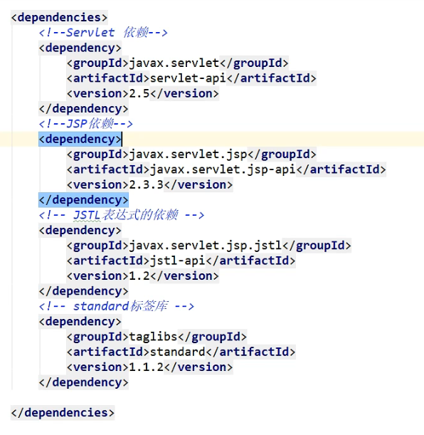
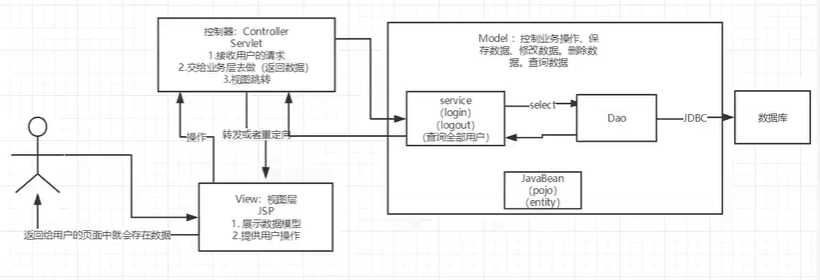
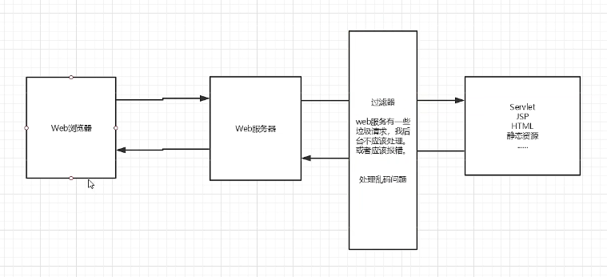

# Javaweb

## # servlet

实现lservlet接口的java程序叫servlet

### ## HelloServlet

1. 构建一个普通的Maven项目，删除src目录，这个空工程就是Maven主工程

2. Maven存在父子工程

   - 父项目中会有

   ```java
   <modules>
       <module>servlet-01</module>
   </modules>
   ```

   - 子项目中会有

   ```java
   <parent>
       <artifactId>Javaweb</artifactId>
       <groupId>com.yang</groupId>
       <version>1.0-SNAPSHOT</version>
   </parent>
   ```

​		父项目中的java子项目可以直接使用

3. 编写Servlet

   1. 编写普通类，实现Servlet接口

   ```java
   public class HelloServlet extends HttpServlet {
       @Override
       protected void doGet(HttpServletRequest req, HttpServletResponse resp) throws ServletException, IOException {
           PrintWriter writer = resp.getWriter();
           writer.print("Hello! Servlet");
       }
   
       @Override
       protected void doPost(HttpServletRequest req, HttpServletResponse resp) throws ServletException, IOException {
           this.doGet(req, resp);
       }
   }
   ```

4. 实现Servlet的映射

   实现从java程序映射到web域名，需要在web服务中进行注册

   ```xml
   <!--  注册servlet-->
     <servlet>
       <servlet-name>hello</servlet-name>
       <servlet-class>com.yang.servlet.HelloServlet</servlet-class>
     </servlet>
   <!--  servlet的映射路径-->
     <servlet-mapping>
       <servlet-name>hello</servlet-name>
       <url-pattern>/hello</url-pattern>
     </servlet-mapping>
   ```

	5. 配置Tomcat

- 实例化servlet 500错误解决办法
  - 原因：Tomact10版本下的 javax.servlet 换成了 jaraka.servlet 
  - 解决方法：将Tomcat10的 servlet-api.jar 导入到项目的lib下
    1. 点击 file->projectstructure
    2. 点击libraries
    3. 选择tomcat10目录下的lib下的 servlet-api.jar 包
    4. 更改所有的 import javax 为 jaraka

### ## Mapping问题

1. 一个Servlet可以指定一个映射路径

```xml
<servlet-mapping>
  <servlet-name>hello</servlet-name>
  <url-pattern>/hello</url-pattern>
</servlet-mapping>
```

2. 一个Servlet可以指定多个映射路径
3. 支持通配符

```xml
<servlet-mapping>
  <servlet-name>hello</servlet-name>
  <url-pattern>/*</url-pattern>
</servlet-mapping>
```

4. 可以自定义后缀实现请求映射，但是 * 前不能加任何路径

```xml
<servlet-mapping>
  <servlet-name>hello</servlet-name>
  <url-pattern>*.houzhui</url-pattern>
</servlet-mapping>
```

### ## ServletContext

web容器在启动时，会为每个web容器创建一个 ServletContext 对象，代表了当前的web应用

1. 共享数据
   - 实现在不同的Servlet中传递数据

```java
// 放数据    
public class servletcontext extends HttpServlet {
    @Override
    protected void doGet(HttpServletRequest req, HttpServletResponse resp) throws ServletException, IOException {
        PrintWriter writer = resp.getWriter();
        ServletContext servletContext = this.getServletContext();
        servletContext.setAttribute("username", "user");
    }
}

// 拿数据
public class getservlet extends HttpServlet {
    @Override
    protected void doGet(HttpServletRequest req, HttpServletResponse resp) throws ServletException, IOException {
        ServletContext servletContext = this.getServletContext();
        String username = (String) servletContext.getAttribute("username");
        System.out.println(username);
    }
}
```

```xml
  <servlet>
    <servlet-name>hello</servlet-name>
    <servlet-class>com.yang.servlet.servletcontext</servlet-class>
  </servlet>
  <servlet-mapping>
    <servlet-name>hello</servlet-name>
    <url-pattern>/hello</url-pattern>
  </servlet-mapping>

  <servlet>
    <servlet-name>get</servlet-name>
    <servlet-class>com.yang.servlet.getservlet</servlet-class>
  </servlet>
  <servlet-mapping>
    <servlet-name>get</servlet-name>
    <url-pattern>/get</url-pattern>
  </servlet-mapping>
```

2. 获取初始化参数

```xml
<!--  配置初始化参数-->
  <context-param>
    <param-name>url</param-name>
    <param-value>i am url</param-value>
  </context-param>
```

```java
public class servletDemo03 extends HttpServlet {
    @Override
    protected void doGet(HttpServletRequest req, HttpServletResponse resp) throws ServletException, IOException {
        ServletContext servletContext = this.getServletContext();
        String url = servletContext.getInitParameter("url");
        System.out.println(url);
    }
}
```

3. 请求转发

```java
public class servletDemo04 extends HttpServlet {
    @Override
    protected void doGet(HttpServletRequest req, HttpServletResponse resp) throws ServletException, IOException {
        ServletContext servletContext = this.getServletContext();
        servletContext.getRequestDispatcher("/url").forward(req, resp);
    }
}
```

```xml
  <servlet>
    <servlet-name>patcher</servlet-name>
    <servlet-class>com.yang.servlet.servletDemo04</servlet-class>
  </servlet>
  <servlet-mapping>
    <servlet-name>patcher</servlet-name>
    <url-pattern>/patcher</url-pattern>
  </servlet-mapping>
```

4. 读取资源文件

```java
public class servletDemo05 extends HttpServlet {
    @Override
    protected void doGet(HttpServletRequest req, HttpServletResponse resp) throws ServletException, IOException {
        ServletContext servletContext = this.getServletContext();
        InputStream resourceAsStream = servletContext.getResourceAsStream("./WEB-INF/classes/db.properties");

        Properties properties = new Properties();
        properties.load(resourceAsStream);
        
        System.out.println(properties.getProperty("passward"));
    }
}
```

### ## HttpServletResponse

1. 向浏览器发送数据的方法

   ```java
   ServletOutputStream getOutputStream() throws IOException;
   
   PrintWriter getWriter() throws IOException;
   ```

2. 向浏览器发送响应头的方法

   ```java
   void setCharacterEncoding(String var1);
   
   void setContentLength(int var1);
   
   void setContentLengthLong(long var1);
   
   void setContentType(String var1);
   
   void setDateHeader(String var1, long var2);
   
   void addDateHeader(String var1, long var2);
   
   void setHeader(String var1, String var2);
   
   void addHeader(String var1, String var2);
   
   void setIntHeader(String var1, int var2);
   
   void addIntHeader(String var1, int var2);
   ```

3. 应用
   - 向浏览器输出信息
   - 下载文件
   
   ```java
       protected void doGet(HttpServletRequest req, HttpServletResponse resp) throws ServletException, IOException {
   //        1. 获取路径
   //        String realPath = this.getServletContext().getRealPath("/1.jpg");
           String realPath = "D:\\Java\\Javaweb\\response\\target\\response\\WEB-INF\\classes\\1.jpg";
   //        2. 获取名称
           String Filename = realPath.substring(realPath.lastIndexOf("\\") + 1);
   //        3. 设置浏览器支持
           resp.setHeader("Content-disposition", "attachment;filename" + Filename);
   //        4. 获取下载文件的输入流
           FileInputStream inputStream = new FileInputStream(realPath);
   //        5. 创建缓冲区
           int len = 0;
           byte[] buffer = new byte[1024];
   //        6. 获取OutputStream对象
           ServletOutputStream respOutputStream = resp.getOutputStream();
   //        7. 将文件流写入缓冲区, 输出到客户端
           while ((len = inputStream.read(buffer)) > 0) {
               respOutputStream.write(buffer, 0, len);
           }
           respOutputStream.close();
           inputStream.close();
   
       }
   ```
   
   - 实现重定向
   
   ```java
   protected void doGet(HttpServletRequest req, HttpServletResponse resp) throws ServletException, IOException {
       resp.sendRedirect("/loaddown");
   }
   ```

### ## HttpServletRequest

http的所有请求会被封装到HttpServletRequest中

- 获取前端参数

  ```java
  String getParameter(String var1);
  
  String[] getParameterValues(String var1);
  ```

## # Cookie & Session

### ## 会话

**会话：**用户访问了多个web资源，关闭浏览器，这个过程可以称之为会话

**有状态会话：**

- 服务端给客户端一个Cookie，下次访问带上Cookie
- 服务器登记来过，下次来的时候进行匹配

### ## 保存会话的两种技术

- cookie
  - 客户端技术（请求、响应）
  
    - 一个cookie只能存一个信息
    - cookie大小有限制
    - 浏览器有cookie上限
  
  - 从请求中拿到cookie
  
  - 再响应回cookie
  
  - 删除cookie
  
    - 不设置有效期，关闭浏览器自动失效
    - 设置有效时间为0
  
    ```java
    protected void doGet(HttpServletRequest req, HttpServletResponse resp) throws ServletException, IOException {
        req.setCharacterEncoding("GBK");
        resp.setCharacterEncoding("GBK");
    
        PrintWriter respWriter = resp.getWriter();
    
        // Cookie 服务器从客户端获取
        Cookie[] cookies = req.getCookies();
    
        if (cookies != null){
            respWriter.write("上一次访问的时间是：");
            for (Cookie cookie : cookies) {
                if (cookie.getName().equals("currentime")){
                    String value = cookie.getValue();
                    long parseLong = Long.parseLong(value);
                    Date date = new Date(parseLong);
                    respWriter.write(date.toString());
                }
    
            }
        }else {
            respWriter.write("第一次访问！");
        }
    
        // Cookie 服务器给客户端响应一个cookie
        Cookie cookie = new Cookie("currentime", System.currentTimeMillis()+"");
        // 设置Cookie有效期
        cookie.setMaxAge(24 * 60 * 60);
    
        resp.addCookie(cookie);
    
    }
    ```
  
- session
  - 服务器技术，保护用户的会话信息
  
  - 与cookie的区别
  
    - Cookie是把用户的数据写给用户的浏览器，浏览器保存
    - Session是把用户的数据写到用户独占的Session中，服务器段保存
    - Session对象由服务器创建
  
    ```java
    //        得到Session
            HttpSession session = req.getSession();
    //        给Session存值
            session.setAttribute("name", new Person());
    //        判断Session是不是新创建的
            if (session.isNew()){
                resp.getWriter().write("session 创建成功, ID: " + session.getId());
            }else {
                resp.getWriter().write("session 在服务器中存在, ID: " + session.getId());
    ```
  
    ```java
    //        拿到Session
            HttpSession session = req.getSession();
            Persion persion = session.getAttribute("name");
            System.out.println(persion.toString());
    ```

## # JSP

JSP：Java服务器端页面，也和Servlet一样，用于动态Web技术

- 本质上就是Servlet



### ## 语法

- JSP表达式

```jsp
<%--JSP表达式--%>
<%--用来将程序的输出到客户端--%>
当前时间: <%= java.util.Calendar.getInstance().getTime() %>
```
- JSP脚本片段

```jsp
<%--JSP脚本片段--%>
<%
    int sum = 0;
    for (int i = 1; i<= 100; i++){
        sum += 1;
    }
    out.println("<h1>Sum = " + sum + "</h1>");
%>
```

- 在代码中内嵌HTML代码

```jsp
<%
    for (int i = 0; i <= 10; i++){
%>
<h1>Hello!!!! <%=i%> </h1>
<%
    }
%>
```

- JSP声明

  > JSP声明：会被编译到JSP生成的java的类中，其他的会被生成 _jspService中

```jsp
<%!
    static {
        System.out.println("静态代码块！");
    }

    private int globalVal = 0;

    public void test(){
        System.out.println("这是测试！");
    }
%>
```

- JSP指令

```jsp
<%@ page args... %>

<%--会将代码合二为一--%>
<%@ include file=""%>
<%--本质上还是别的文件，只是进行引用--%>
<jsp:include page="header.jsp"></jsp:include>
```

### ## 9个内置对象

- PageContext
- Request
- Response
- Session
- Application [ ServletContext ]
- config [ ServletConfig ]
- out
- page
- exception

### ## JSP标签、JSTL标签、EL表达式

1. EL表达式

   ${ }

   - 获取数据

   - 执行运算

   - 获取web开发的常用对象

2. JSP标签

   ```jsp
   <%--页面跳转--%>
   <jsp:forward page="page2.jsp">
       <jsp:param name="name" value="ykx"/>
       <jsp:param name="age" value="12"/>
   </jsp:forward>
   ```

3. JSTL标签

   - JSTL标签库的使用就是为了弥补HTML标签的不足
   - 自定义了许多标签，功能和java代码一样

   [JSP 标准标签库（JSTL） | 菜鸟教程 (runoob.com)](https://www.runoob.com/jsp/jsp-jstl.html)

```jsp
<c:if test="${param.username == 'ykx'}" var="isykx">
    <c:out value="wel ykx"></c:out>
</c:if>
<c:out value="${isykx}"></c:out>
<c:out value="${param.username}"></c:out>
```

## # JavaBean

JavaBean有特定的写法：

1. 必须有一个无参构造
2. 属性必须私有化
3. 必须有对应的 get/set 方法

一般用来和数据库的字段做映射 ORM：对象关系映射

- 表 -> 类
- 字段 -> 属性
- 行记录 -> 对象

##  # MVC三层架构

Model，View，Controller -- 模型，视图，控制器

1. Controller
   - 接收用户的请求
   - 返回数据（业务层）
   - 视图跳转
2. View
   - 展示数据模型
   - 提供用户操作
3. Model
   - 业务处理：业务逻辑（Service）
   - 数据持久层：CRUD（Dao）



## # Filter

Filter：过滤器，用来过滤网站的数据

- 处理中文乱码
- 登录验证



```java
public class FilterDome1 implements Filter {
    @Override
    public void init(FilterConfig filterConfig) throws ServletException {
        System.out.println("filter 正在初始化");
    }

    @Override
    public void doFilter(ServletRequest servletRequest, ServletResponse servletResponse, FilterChain filterChain) throws IOException, ServletException {
        System.out.println("filter 正在工作");
        servletResponse.setContentType("text/html;charset=utf-8");
        servletRequest.setCharacterEncoding("utf-8");

        System.out.println("filterChain 执行前");
        filterChain.doFilter(servletRequest, servletResponse);
        System.out.println("filterChain 执行后");
    }

    @Override
    public void destroy() {
        System.out.println("filter 正在销毁");
    }
}
```

```xml
<filter>
    <filter-name>encodingFilter</filter-name>
    <filter-class>com.yang.filter.FilterDome1</filter-class>
</filter>
<filter-mapping>
    <filter-name>encodingFilter</filter-name>
    <url-pattern>/01/*</url-pattern>
</filter-mapping>
```

## # Listener

```java
public class listenerDemo01 implements HttpSessionListener {

    @Override
    public void sessionCreated(HttpSessionEvent se) {
        ServletContext context = se.getSession().getServletContext();
        Integer count = (Integer) context.getAttribute("onlineCount");

        System.out.println(se.getSession().getId());

        if (count == null) {
            count = new Integer(1);
        } else {
            int c = count.intValue();
            count = new Integer(c + 1);
        }

        context.setAttribute("onlineCount", count);
    }

    @Override
    public void sessionDestroyed(HttpSessionEvent se) {

    }
}
```

```xml
<listener>
    <listener-class>com.yang.listener.listenerDemo01</listener-class>
</listener>
```

