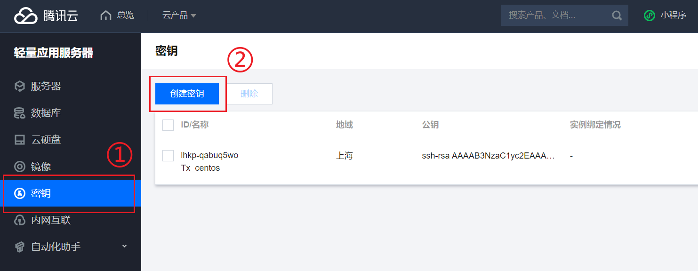
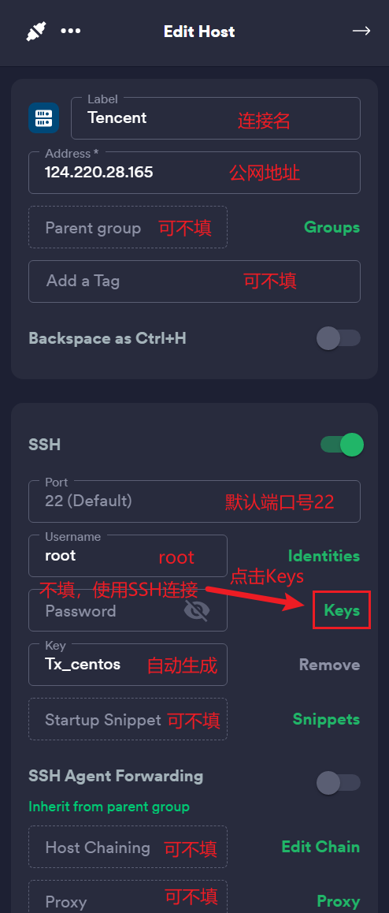

## # SSH远程连接Linux服务器

> 以腾讯云为例

### 创建密钥




​	随后会自动下载私钥，需妥善保存，只有一次下载机会。

### 绑定密钥对


​	点击绑定密钥对，选择刚刚生成的SSH密钥进行绑定。

### 使用Termius远程连接

> [Termius - SSH platform for Mobile and Desktop](https://www.termius.com/)
>
> 多平台支持、Github学生包免费Pro订阅

​	点击添加Host后，添加远程主机



​	配置完成后，点击自己配置的主机，测试连接是否成功


连接成功！


## # Linux

### 系统目录结构

> 一切皆文件
>
> 根目录" / "，所有文件都挂载到根目录下

```shell
ls /
```


- /bin：是Binary缩写，这个目录存放着最经常使用的命令。

- /boot：存放启动Linux时的核心文件，包括一些连接文件和镜像文件。
- /dev：是Device缩写，存放的是Linux外设。
- **/etc：存放系统管理需要的配置文件和子目录。**
- **/home：用户主目录，每一个用户都有自己的目录。**
- /lib(lib64)：系统最基本的动态链接库，类似Windows中DDL文件。
- /lost+found：当系统非法关机时，会存入一些文件。
- /media：即插即用型存储设备的挂载点，例如U盘、光驱等。
- /mnt：用来临时挂载其他的文件系统，一般是用于存放挂载储存设备的挂载目录。（用于挂载本地文件）
- **/opt：主机额外安装软件所在的目录。**
- /proc：是一个虚拟文件目录，是内存的映射，可以直接访问这个目录来获取系统信息。
- **/root：系统管理员的主目录。**
- /run：保存在下一次系统引导前关于系统的信息文件。
- /sbin：系统管理员所用的系统管理程序。
- /srv：一些网络服务启动后，这些服务所需要取用的数据目录。
- /sys：该目录下安装了2.6内核中新出现的一个文件系统sysfs。
- **/tmp：存放临时文件。**
- **/usr：是Unix Software Resource的缩写，是Unix Software Resource的缩写，类似windows下的program file目录。**
- /var：这个目录的内容经常变动，/var/log是用来存放系统日志的目录。
- **/www：存放服务器网站相关的资源。**

### 常用命令

#### 目录管理

```bash
cd			# 返回上级目录
	/xx/xx		# 绝对路径，以" / "开头
	..			# 上级目录
	.			# 本级目录
	~			# 回到当前用户目录
	
ls			# 列出目录
	-a			# 查看全部，包括隐藏目录
	-l			# 列出所有文件，包含文件的属性和权限
	
pwd			# 显示当前所在目录

mkdir		# 创建一个目录
	-p		# 递归创建多级目录

rmdir		# 删除目录，需要非空
	-p		# 递归删除目录

cp			# 复制文件或目录
	file new	# 将file复制到new

mv			# 移动文件或目录，可以重命名目录
	-f			# 强制移动
	-u			# 只替换重复的文件
	
rm			# 删除文件或目录
	-f			# 强制删除
	-r			# 递归删除目录 
	-i			# 删除时询问是否删除

find		#  递归查找所有目录和文件
	 路径				# 查找路径下的所有文件和目录
	 -type d		  # 只看目录
	 -type f		  # 只看文件
	 -name "f*"		  # 查找以f为开头的
	 -i				 # 不区分大小写
```

#### 基本属性


​	在Linux中第一个字符代表文件类型

- **[d]是目录**
- **[-]是文件**
- **[l]是链接文档**
- [b]是装置文件里面可供存储的接口设备
- [c]是装置文件里面串行端口设备

​	接下来的字符中，以三个为一组，且均为[rwx]的三个参数的组合，[-]代表没有权限。


```bash
# 修改文件属性权限
chomd [-R] 文件名

r：4		w：2		x：1
可读可写可执行		rwx	7
可读可写不可执行	rw-	6

chomd 777 filename	# 赋予最高权限
```

#### 文件内容

```bash
cat			# 由第一行开始显示文件内容

tac			# 从最后一行开始显示

nl			# 显示的时候输出行号

more		# 一页一页显示文件内容
#（空格翻页，回车翻一行，[q]命令退出，[/]命令向下查找内容，[?]命令向下查找命令）

less		# 与more类似，可以上翻页

head		# 只看头几行
	-n x		# 选择看x行
		
tail		# 只看尾几行
	-n x		# 选择看x行
		
ifconfig	# 查看网络配置
```

> Linux链接的概念

​	Linux的链接分为硬链接、软链接

- 硬链接：A--B，假设B是A的硬链接，那么他们两个指向了同一个文件，可以使用硬链接机制防止误删文件。
- 软连接：类似Windows下的快捷方式，删除了源文件，快捷方式也无法访问。

```bash
ln f1 f2		# 创建f2为f1的硬链接
ln -s f1 f3v		# 创建f3为f1的软连接
```

#### 账号管理

```bash
useradd			# 添加用户
		-m			# 自动创建这个用户的主目录
		-g			# 给用户分配组
		
userdel			# 删除用户
		-r		# 删除用户时候一并删除用户目录

```


- [#]表示超级用户
- [$]表示普通用户

```bash
hostname			# 查看主机名
		name			# 重命名主机名
		
passwd				# 在普通用户，下修改密码
passwd username		# 在超级用户下，修改名为username的用户密码
		-l	username	# 在超级用户下，锁定名为username的用户
```

#### 用户组管理

​	每个用户都有一个用户组，系统可以对一个用户组中的所有用户进行集中管理

```bash
groupadd name		# 创建用户组
			-g			# 指定用户组id

groupdel name		# 删除用户组

groupmod name		# 修改用户组
			-g			# 修改id
			-n			# 修改名字
```

> /etc/passwd：用户目录


```bash
root :            x          :     0    :    0   :    root    : /root: /bin/bash
用户名：口令（登陆密码，不可见）：用户标识号：组标识号：注释性描述性：主目录：登录Shell
```

​	此文件的每一行都是一个用户，可以看出这这个用户的主目录所在

> /etc/shadow：储存登录密码


​	会转码加密存储

> /etc/group：储存用户组

#### 磁盘管理

```bash
df			# 列出文件系统整体磁盘使用量
	-h			# 使用常规单位标准
	
du			# 列出当前磁盘空间使用量
	-a			# 展示所有，包含隐藏文件
	-sm /*		# 检查根目录使用量
	
mount 设备路径 挂载路径	# 挂载外设存储
unmount 设备路径	# 卸载设备
	-f				# 强制卸载
```

#### 进程管理

1. 在Linux中每个进程都有一个id号
2. 每个进程都有一个父进程
3. 进程有两种存在方式：前台&后台

> [|] 在Linux中名为管道符 A|B A的结果传递给B
>
> [grep] 在文件中查找符合条件的字符串

```bash
ps			# 查看当前系统中正在执行的各种进程的信息
	-a			# 显示当前终端运行的所有进程信息（当前的进程）
	-u			# 以用户来显示进程
	-x			# 显示所有后台运行进程
	
ps -aux			# 查看所有进程信息

ps -aux|grep name	# 查找到name进程的所以信息

ps -ef			# 查看父进程的信息

pstree		# 进程树
	-p			# 显示父进程id
	-u			# 显示用户组
	
kill -9 进程id	# 强制结束进程
```

#### 重定向

将输出流重定向至某个位置

```bash
cat file1 > file2	# 将file1的内容重定向至file2
```


### Yum & Rpm

​	rpm 是linux的一种软件包名称，以.rpm结尾，rpm包的安装有一个很大的缺点就是文件的关联性太大，有时候装一个软件要安装很多其他的软件包，为此RedHat开发了yum安装方法。

​	Yum 是一个前端软件包管理器。基于rpm包管理，能够从指定的服务器自动下载RPM包并且安装，可以自动处理依赖性关系，并且一次安装所有依赖的软体包。

```bash
yum install 软件包名	# 安装/升级软件包

yum update			# 升级所有软件包
		-name			# 升级软件包

yum remove 软件包名		# 删除软件包

yum search 软件包名		# 查找软件包

yum clean			# 清除缓存
```


## # Vim

### 正常模式

​	使用Vim进入文件后，默认处于正常模式，若文件不存在则自动创建。

```bash
vim test.txt
```

- 按 "i" 进入编辑模式，插入到**字符前**
- 按 "shift + i" 进入编辑模式，插入到**此行最前面**
- 按 "a" 进入编辑模式，插入到**字符后**
- 按 "shift + a" 进入编辑模式，插入到**此行最后面**
- 按 "o" 进入编辑模式，并**新增下一行**，光标挪至新行
- 按 "shift + o" 进入编辑模式，并**新增上一行**，光标挪至新行
- 按 "shift + g" 移动光标至最后一行
- 按 "gg" 移动光标至第一行
- 按 "yy" 复制当前行
- 按 "yw" 复制当前单词
- 按 "p" 往下粘贴一行
- 按 "np" 往下粘贴n行，n取值正整数
- 按 "dd" 删除当前行
- 按 "." 重复前次操作
- 按 "u" 撤销前次操作
- 按 "w" 光标移动到下个单词首部
- 按 "b" 光标移动到上个单词首部
- 按 "ctrl + r" 恢复前次操作
- 按 "ctrl + v" 可视化块
- 按 ":" 进入命令行模式

### 编辑模式

- 按 "Esc" 退出编辑模式，进入正常模式

### 命令行模式

- 输入 "q" 仅退出
- 输入 "q!" 不保存退出
- 输入 "wq" 保存退出
- 输入 "/something" 在内容中搜索something
