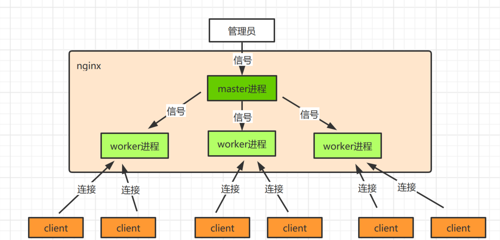
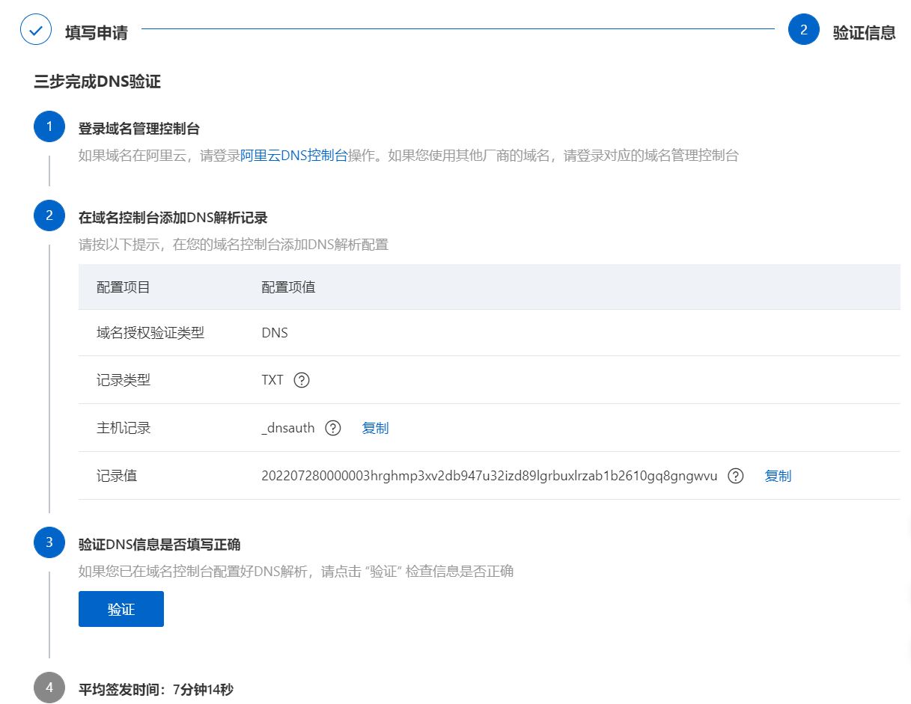
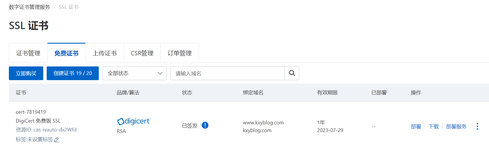
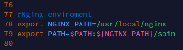
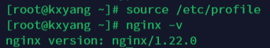

## # 目录结构

```shell
conf	# 配置文件
	-nginx_conf	# 主配置文件
	
html	# 默认的静态资源

logs	# 日志
	-access.log	# 访问日志
	-error.log	# 错误日志
	-nginx.pid	# 主进程进程号
sbin	# nginx主程序
```

## # 请求流程



## # 基础配置

- 最小配置文件

```nginx
worker_processes 1;		# wworker进程的个数，一个cpu内核对应一个worker_processes

events {	# 事件驱动模块
    worker_connections 1024;	# 每一个worker可以创建的最大连接数
}

http {		# http模块
    include mime.types;		# 引入另一个配置文件，mime.types 内记载了对应文件所进行的服务器响应的类型
    default_type application/octet-stream;	# 默认响应类型
    
    sendfile on;	# 数据零拷贝
    keepalive_timeout 65;	# 保持连接超时时间
   	
    # 虚拟主机
    server {
		listen 80;	# 监听当前端口号
        server_name localhost;	# 域名、主机名
        
        # http://xxx.com [/xx/index.html] --> 配置URI资源
        location /{
			root html;	# 资源根目录，相对路径
            index index.html index.htm;	# 默认页
        }
        
        error_page 500 502 503 504 /50x.html;	# 如果错误码，则转向后面的页面
        location = /50x.html {
            root html
        }
    }
}
```

- 站点配置

```nginx
mkdir www
cd www/
mkdir www	# www站点
mkdir vod	# vod站点
```

- server_name 及 location 匹配规则

​	[Nginx server_name和location匹配规则](https://cloud.tencent.com/developer/article/1814782)

## # 反向代理

- 在location部分下进行配置

```nginx
location /{
    
    proxy_pass http://www.xxx.com;	# 将请求转发到 http://www.xxx.com
    # 配置反向代理后，下面的文件失效
    root html;	# 资源根目录，相对路径
    index index.html index.htm;	# 默认页
}
```

## # 负载均衡

```nginx
...
第一种：
upstream httpds {	# 使用默认的负载均衡：轮询
    server 192.168.1.1:80;
    server xxx.xxx.x.x:80;
}
第二种：
upstream httpds {	# 使用权重的负载均衡：每8次进第一个，2次进第二个
    server 192.168.1.1:80 weight=8 down;	# 加了down后，不参与负载均衡
    server xxx.xxx.x.x:80 weight=2 backup;	# 加了backup后，当没有其他机器能用时，才启用
}
# 虚拟主机
server {
...
    location /{
        proxy_pass http://httpds;	# 这里的域名要在server上面定义
        root html;	# 资源根目录，相对路径
        index index.html index.htm;	# 默认页
    }
    
...
    }
}
}
```

## # 动静分离


- 基本配置

```nginx
server {
...
    location /{
        proxy_pass http://httpds;	# 这里的域名要在server上面定义
    }
    location /js{	# 访问proxy_pass时所有的js文件从nginx服务器的root目录中寻找，而不走代理的服务器
        root html
        index index.html index.htm;
    }
    location /css{	# 同理
        root html
        index index.html index.htm;
    }
    location /img{	# 同理
        root html
        index index.html index.htm;
    }
    # 使用正则表达式
    location ~*/(js|img|css){
        root html
    	index index.html index.htm;
    }
...
    }
```

## # URL伪静态

```nginx
location /{
    rewrite ^/([0-9]+).html$ /index.jsp?pageNum=$1 break;
    # 进行伪静态配置，将?带参的形式伪装成静态样式
    proxy_pass http://httpds;	# 这里的域名要在server上面定义
}
```

- last：本条规则匹配完成后，继续向下匹配新的location URI规则
- break：本条规则匹配完成后即终止，随后不再匹配
- redirect：返回302临时重定向，会显示原来的URL地址
- permanent：返回301永久重定向，会显示原来的URL地址

## # 防盗链

- 通过referer参数头来实现防盗链，referer是浏览器实现的规则，其是由浏览器网页在请求的时候加上
- 限制哪个资源，就放在对应location下

```nginx
location ~*/(js|img|css){
    valid_referers xxx.xxx.xx.xxx;	# 检测资源的来源地址
    if ($invalid_referer) {	# 检测若是无效的的referer，则返回403
        return 403
    }
    # 第二种：结合rewrite返回错误图片
    if ($invalid_referer) {	# 检测若是无效的的referer，则返回错误图片
        rewrite ^/ /img/error.png break;
    }
    root html
	index index.html index.htm;
}
```

- valid_referers
  - none 检测referer不存在的情况
  - blocked，检测referer的值被防火墙或者代理服务器删除或伪装的情况
  - server_names，具体的URL

## # HTTPS

### 证书申请

[CA认证-阿里云](https://www.aliyun.com/product/cas)





### 证书安装

```nginx
server {
    listen 443 ssl;
    server_name aa.bb.com;
    
    ssl_certificate pemAddress;
    ssl_certificate_key keyAddress;
}
```

## # linux安装Nginx

[NGINX 官方下载](https://nginx.org/en/download.html)

1. 下载Nginx压缩包

```bash
cd /root   # 进入指定目录，目录请自行选择
wget https://nginx.org/download/nginx-1.22.0.tar.gz   # 下载安装包
```

2. 解压压缩包

```bash
tar -zxvf nginx-1.21.2.tar.gz   # 解压
```

> 如果缺少依赖，按照提示安装完依赖后，再次解压

```bash
# the HTTP rewrite module requires the PCRE library.
yum install -y pcre pcre-devel
# Invalid C++ compiler or C++ compiler flags.
yum install -y gcc gcc-c++
# the HTTP gzip module requires the zlib library.
yum install -y zlib-devel
```

3. 执行编译

```bash
./configure --with-http_stub_status_module --with-http_ssl_module	# 使用配置
make
```

4. 执行安装

```bash
make install
```

5. 运行Nginx

```bash
whereis nginx   # 查找安装路径
cd /usr/local/nginx   # 进入nginx的安装路径
./sbin/nginx   # 运行
```

6. 访问ipAddress:80


7. 将Nginx加入系统环境变量

- 操作配置文件

```bash
vim /etc/profile	# 操作配置文件
```

- 增加Nginx环境变量

```bash
#Nginx enviroment
export NGINX_PATH=/usr/local/nginx
export PATH=$PATH:${NGINX_PATH}/sbin
```



- 刷新配置文件

```bash
source /etc/profile
```

- 测试

```bash
nginx -v
```



### 常用命令

```bash
cd /usr/local/nginx   # 进入安装路径
nginx   # 启动
nginx -s reload   # 重载
nginx -s stop   # 强制关闭
nginx -s quit   # 优雅关闭（当请求被处理完成之后才关闭）
```

