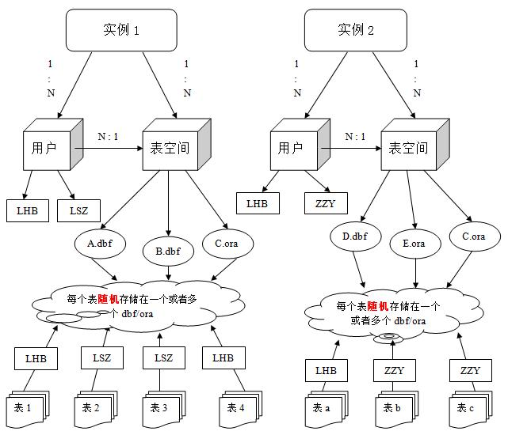

user:system

secret:Oracle

## Oracle 体系结构

### 数据库

​	Oracle数据库是数据的物理存储，包括

- 数据文件ORA / DBF
- 控制文件
- 联机文件
- 参数文件

​	Oracle数据库的概念和其他数据库不一样在于，这里的数据库是一个操作系统，只有一个库，可以看作Oracle就只有一个大数据库

### 实例

​	一个Oracle实例有一系列的后台进程和内存结构组成，一个数据库可以有n个实例

### 数据文件

​	是数据库的物理存储。数据库的数据是存储在表空间中，真正是在某一个或者多个数据文件中。

- 一个表空间可以由一个或多个数据文件组成，一个数据文件只能属于一个表空间
- 一旦数据文件被加到某个表空间后，就不能删除这个文件
- 如果要删除某个数据文件，只能删除其所属的表空间

### 表空间

​	是Oracle对物理数据库上相关数据文件的逻辑映射，一个数据库在逻辑上被划分为一个到若干个表空间，每个表空间包含了在逻辑上相关联的一组结构


### 用户

​	用户是在表空间下建立的，用户登陆后只能看到和操作自己的表，每建立一个应用需要创建一个用户



## 语法

### 创建表空间

​	实质上是创建数据文件，会自动创建一个数据文件

```sql
create tablespace Xxxx
datafile 'D:\xxx\xxx'
size 100m
autoextend on
next 10m
```

### 创建用户

```sql
create user Ccc
identified by itcast
default tablespace Xxxx
```

### 用户赋权

```sql
grant dba to Ccc
```

### 表的创建、修改、删除

```sql
-- 创建表
create table tablename(
	字段名 类型（长度） primary key;
	...
)

-- 修改表
-- 追加字段
alter table tablename add(

)
-- 修改字段
alter table tablename modify(

)
-- 修改字段名
alter table tablename rename column columnname to new_columnname
-- 删除字段名
alter table tablename drop column columnname

-- 删除表
alter table tablename
```

## 数据的导出与导入

- 整库导出导入

```shell
exp 用户名/密码 full=y file=指定文件名
imp 用户名/密码 full=y file=url
```

- 按用户导入导出

```shell
exp 用户名/密码 owner=Xxx file=指定文件名
imp 用户名/密码 fromuser=Xxx file=指定文件名
```

- 按表导入导出
  - 表名空格分开

```shell
exp 特定用户名/密码 tables=Xxx file=指定文件名
imp 特定用户名/密码 tables=Xxx file=指定文件名
```

