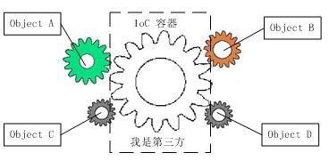
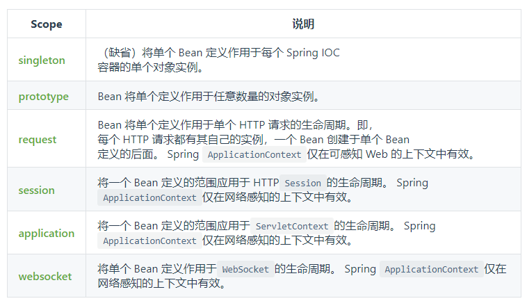

# Spring

- 开源的免费框架（容器）
- 轻量级非入侵式框架
- 控制反转（IOC），面向切面编程（AOP）

## # IoC

IOC理论提出的观点大体是这样的：借助于“第三方”实现具有依赖关系的对象之间的解耦



对象A获得依赖对象B的过程，由主动行为变为了被动行为，控制权颠倒过来了，这就是“控制反转”这个名称的由来。

## # HelloSpring

- 使用bean创建对象

```java
package com.yang.spring;

public class Hello {
    private String str;

    public String getStr() {
        return str;
    }

    public void setStr(String str) {
        this.str = str;
    }

    @Override
    public String toString() {
        return "Hello{" +
                "str='" + str + '\'' +
                '}';
    }
}
```

```xml
<?xml version="1.0" encoding="UTF-8"?>
<beans xmlns="http://www.springframework.org/schema/beans"
       xmlns:xsi="http://www.w3.org/2001/XMLSchema-instance"
       xsi:schemaLocation="http://www.springframework.org/schema/beans
        https://www.springframework.org/schema/beans/spring-beans.xsd">

<!--使用 Spring 创建对象，都称为 Bean-->
    <bean id="hello" class="com.yang.spring.Hello">
        <property name="str" value="Spring"></property>
    </bean>


</beans>
```

```java
public class Mytest {
    public static void main(String[] args) {
        // 获取 Spring 的上下文对象
        ApplicationContext context = new ClassPathXmlApplicationContext("beans.xml");
        Hello hello = (Hello) context.getBean("hello");
        System.out.println(hello.toString());
    }
}
```

## # IoC创建对象的方式

Spring 在创建 Bean 时，就创建了对象

1. 默认使用无参构造创建对象

2. 有参构造

   - ```java
     // 使用参数索引构造
     <bean id="exampleBean" class="examples.ExampleBean">
         <constructor-arg index="0" value="7500000"/>
         <constructor-arg index="1" value="42"/>
     </bean>
     ```

   - ```java
     // 使用参数类型赋值，只能有一个
     <bean id="exampleBean" class="examples.ExampleBean">
         <constructor-arg type="int" value="7500000"/>
         <constructor-arg type="java.lang.String" value="42"/>
     </bean>
     ```

   - ```java
     // 使用参数名赋值
     <bean id="exampleBean" class="examples.ExampleBean">
         <constructor-arg name="years" value="7500000"/>
         <constructor-arg name="ultimateAnswer" value="42"/>
     </bean>
     ```

## # Spring 配置

- alias

  ```xml
  <!-- 别名 -->
  <alias name="user" alias="userNew" />
  ```

- bean

  ```xml
  <!-- 
  id：位于标识符，即对象名
  class：bean 对象所对应的全限定名
  name：别名，且可以同时取多个别名
  -->
  
  <bean id="hello" class="com.yang.spring.Hello" name="hello1 hello2 ...">
      <property name="str" value="Spring"></property>
  </bean>
  ```

- import

  ```xml
  <!-- 导入多个配置文件 -->
  <import resource="beans.xml"/>
  ```

## # 依赖注入

### ## 构造器注入

### ## Set注入

- 依赖注入：本质是Set注入
  - 依赖：bean对象的创建依赖于容器
  - 注入：bean对象中的所有属性，由容器来注入

```xml
<bean id="address" class="com.yang.spring.Address"/>

<bean id="student" class="com.yang.spring.Student">
    <!-- 普通值注入，value-->
	<property name="name" value="xxxxx"></property>
    
    <!-- bean注入，ref-->
    <property name="address" value="address"></property>
    
    <!-- 数值注入 -->
    <property name="books">
    	<array>
        	 <value>红楼梦</value>
			<value>西游记</value>
        </array>
    </property>
    
    <!-- List注入 -->
    <property name="hobbys">
    	<list>
        	<value>听歌</value>
        	<value>看定影</value>
        </list>
    </property>
    
    <!-- Map注入 -->
    <property name="card">
    	<map>
        	<entry key="身份证" value="xxx"/>
        	<entry key="银行卡" value="xxx"/>
        </map>
    </property>
    
    <!-- Set注入 -->
    <property name="games">
		<set>
        	<value>lol</value>
        	<value>coc</value>
        </set>
    </property>
    
    <!-- null注入 -->
    <property name="wife">
		<null/>
    </property>
    
    <!-- properties注入 -->
    <property name="info">
		<props>
        	<prop key="学号">xxxx</prop>
        	<prop key="姓名">xxxx</prop>
        </props>
    </property>
    
</bean>
```

### ## 拓展方式注入

> 需要导入 xml 约束

- p 命名空间注入
  - 直接在标签内注入，使用set注入
- c 命名空间注入
  - 使用构造器注入

## # Bean的作用域



- 单例模式：singleton
  - 默认机制，只有一个对象
- 原型模式：prototype
  - 每次从容器内get时，都会产生一个对象
- 其余的 request, session, application 都是在web开发中使用到

## # Bean的自动装配

- 自动装配是Spring满足bean依赖的一种方式
- Spring会在上下文中自动寻找，并自动给bean装配

在Spring中有三种装配方式

1. 在xml中显示配置
2. 在java中显示配置
3. 隐式装配bean

```xml
<bean id="student" class="com.yang.spring.Student" autowire="byName"/>

<!-- 
autowire="byName" :在容器内自动查找和自己对象 set 方法后面的值对应的 beanid
autowire="Type" :在容器内自动查找和自己对象属性类型相同的 bean
 
```

### ## 使用注解自动装配

1. 导入约束

2. 配置注解支持

   ```xml
   <?xml version="1.0" encoding="UTF-8"?>
   <beans xmlns="http://www.springframework.org/schema/beans"
       xmlns:xsi="http://www.w3.org/2001/XMLSchema-instance"
       xmlns:context="http://www.springframework.org/schema/context"
       xsi:schemaLocation="http://www.springframework.org/schema/beans
           https://www.springframework.org/schema/beans/spring-beans.xsd
           http://www.springframework.org/schema/context
           https://www.springframework.org/schema/context/spring-context.xsd">
   
       <context:annotation-config/>
   
   </beans>
   ```

   - @Autowired

     - 用来代替 Spring 的 @Autowired 注释
     - 直接在属性上使用即可，也可以在 set 方法上使用

小结：

@Resource 和 @Autowired 的区别：

- 都是用来自动装配的，都可以放在属性字段上
- @Autowired 通过 byType 的方式实现，而且必须要求这个对象存在
- @Resource 默认通过 byname 的方式实现，如果找不到名字，则通过 byType 实现，都找不到则报错


## # 使用注解开发

1. bean

2. 属性如何注入

   ```java
   @Component
   public class User{
       public String name;
       
       // 相当于<property name="name" value="kx">
       @value("kx")
       public void setName(String name){
           this.name = name;
       }
   }
   ```

3. 衍生的注解

   @Component 有几个衍生注解

   - dao -- @Repository
   - service -- @Service
   - controller -- @Controller

   这四个注解功能是一样的，都是代表将某个类注册到Spring中

4. 作用域

   ```java
   @Component
   @Scope("prototype")
   public class User{
   	xxx
       }
   }
   ```

## # 使用 java 的方式配置 Spring

## # 代理模式

### ## 静态代理

### ##动态代理

## # AOP

### ##  Aop在Spring中的作用

​	提供声明式事务:允许用户自定义切面

​	横切关注点:跨越应用程序多个模块的方法或功能.既是,与我们业务逻辑无关,但是我们需要关注的部分,就是横切关注点.如日志,安全,缓存,事务等

- 切面（ASPECT）：横切关注点 被模块化 的特殊对象。即，它是一个类。
- 通知（Advice）：切面必须要完成的工作。即，它是类中的一个方法。
- 目标（Target）：被通知对象。
- 代理（Proxy）：向目标对象应用通知之后创建的对象。
- 切入点（PointCut）：切面通知 执行的 “地点”的定义。
- 连接点（JointPoint）：与切入点匹配的执行点。

### ## 在Spring中实现AOP

需要使用 AOP织入 需要导入一个依赖包

方式一：使用Spring的API接口

方式二：自定义来实现AOP

## # 声明式事务


