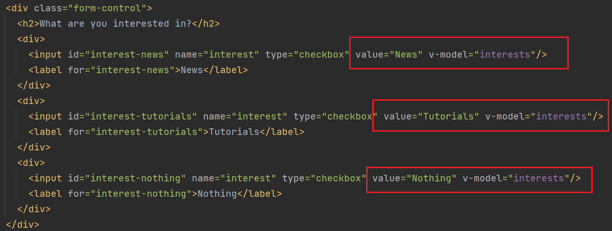
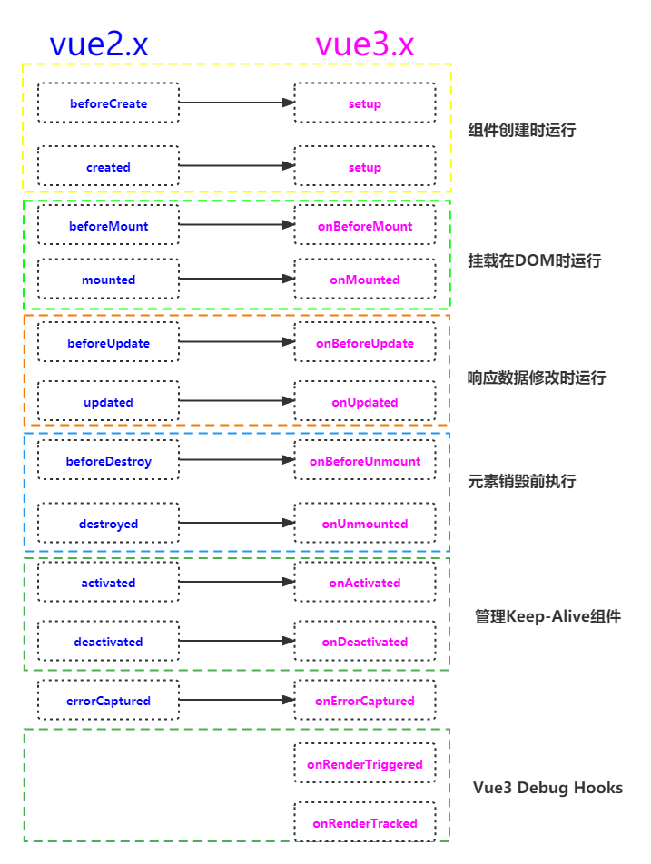

> [vue风格指南](https://v3.cn.vuejs.org/style-guide/#%E8%A7%84%E5%88%99%E7%B1%BB%E5%88%AB): 针对 Vue 代码的官方风格指南

## # **基础&核心概念 - DOM与Vue的交互**

> **Basics & Core Concepts - DOM Interaction with Vue**

### 插值语法

​	{{  }}可以将js内的数据绑定到两个<><>之间，可以是静态数据，也可以调用函数。

```vue
<somethig>{{  }}<something>
```


### v-bind

​	将js内的数据绑定到一个<>内。

```vue
<p>Learn more <a v-bind:href="vueLink">about Vue</a></p>
```

### this

​	指向Vue实例对象，用来调用实例对象的任何内容。

### v-html

​	将两个<><>之间的内容按照HTML进行解释，但是会带来安全，绕过了内置的跨站点脚本攻击保护。

```vue
<p v-html="courseGoalB"></p>
"""
courseGoalB: '<h2>Master Vue and build amazing apps!<h2>'
"""
```

### v-on

​	绑定Event，并添加事件。

```vue
<button v-on:click="counter++">Add</button>
```

```vue
<button v-on:click="add()">Add</button>
"""
methods: {
	add(){
		this.counter++;
	}
}
"""
```

​	v-on绑定HTML DOM事件对象，当传入一个函数的指针时，默认会向函数传入一个event事件对象。当传入一个函数过程时，需要显式使用$event来传入event事件对象。

```vue
<input type="text" v-on:input="setName">
<input type="text" v-on:input="setName($event, ' White')">
<p>Your Name : {{  name  }}</p>
"""
setName(event){
	this.name = event.target.value;
}
setName(event, lastname){
	this.name = event.target.value + lastname;
}
name: ""
"""
```

### event.preventDefault()

​	阻止浏览器的默认事件，可以使用事件修饰符更简洁。例如 **v-on:keyup.enter="function"** 监听enter回车键的按压事件。

```vue
<form v-on:submit.prevent="submitForm"><form>
```

### v-once

​	告诉组件，任何动态数据绑定都只应该计算一次。

### v-model

​	由Vue来管理data属性，会自动更新并发送回data属性值，名为“双向绑定”。

### computed与watch

​	computed计算属性，用于动态计算多个属性的联合值，具有缓存；watch观察者，用于观察某个属性值，若属性值改变，则进行某些操作。

### " @ "与" : "

​	v-bind 可用" : "代替。

​	v-on 可用" @ "代替。

```vue
<form v-on:submit.prevent="submitForm"><form> => <form @submit.prevent="submitForm"><form>
<form v-bind:something="submitForm"><form> => <form :something="submitForm"><form>
```

### 动态绑定CSS样式：

```vue
<div class="demo" :class="{active: selectA}" @click="selectEl('A')"></div>
"""
其中class常规绑定css样式，
:class为Vue语法，动态绑定CSS样式，向其内传递对象。
"""
```

​	最好使用computed动态返回CSS对象。

## # 呈现有条件的内容和列表

> **Rendering Conditional Content & Lists**
>

### v-if

​	通过某些条件控制是否渲染HTML元素

```vue
<p v-if="goals.length === 0">No goals have been added yet - please start adding some!</p>
```

### v-show

​	与v-if相同，但是v-show不会向DOM添加或删除元素，只是给CSS添加display的属性。

### v-for

​	循环遍历数据，使用插值语法循环输出。

```vue
<li v-for="goal in goals" :key="goal">{{ goal }}</li>
```

​	**一定要加"key"属性**

## # 组件介绍

> **Introducing Components**

### app.components()

​	类似于创建一个小型app，在HTML代码中使用组件名字重用组件。

```vue
app.components('name-doWhat', {
	template:`HTML模字符串`,
	data(){},
	methods:{}
})
```

## # 使用更好的开发步骤 & 使用Vue CLI

> **Moving to a Better Development Setup & Workflow with the Vue CLI**

### Vue CLI

```vue
vue create 名字;
cd 名字;
npm run serve;
```

​	在main.js中进行应用的创建及挂载、组件的注册。

​	在App.vue中的代码将挂载到**" ../public/index/html "**页面。

​	在components文件夹下的vue组件将挂载到App.vue文件内使用。

## # 组件信息交互

> **Component Communication**

### props

​	在组件内加入props属性后，可以向子组件内传递信息，遵循单向数据流模式。

```vue
props: ['name1', 'name2']
or
props: {
	name: {
		type: String,
		required: true,
		//default: 'something',
		//default: function(){},
		validator: function(){	//验证器
			return (true or false)
		}
	}
}
```

### $emit

​	为了从子组件向父组件传递信息，在子组件内绑定$emit事件，在父组件内监听此事件，如果监听到则进行处理。

```vue
"""子组件"""
toggleFavorite() {
	this.$emit('changeFavorite', this.id)
}
"""父组件"""
@changeFavorite="changeFavorite";
changeFavorite(id){
	const friend = this.friends.find((friend)=>friend.id === id);
	friend.isFavorite = !friend.isFavorite
}
```

### emits

​	为了更加清晰的看出子组件内将发出哪些事件，可以给子组件添加emits属性，表明子组件将会发出哪些事件。

```vue
props: [
    'id',
    'name',
    'phone',
    'email',
    'isFavorite'
],
emits: [
	'changeFavorite'
],
```

### provide与inject

​	为了防止父组件、子组件、子孙组件信息的链式传递，引入provide和inject按需使用。

​	inject的数据只能在父组件的provide属性中提供了才能使用。

## # 深入研究组件

> **Diving Deeper Into Components**

### 全局组件与本地组件

​	需要在不同地方使用的组件注册全局组件，否则注册本地组件。


​	本地组件需要在组件内部进行导入，使用components属性进行注册。


### scoped

​	给vue组件的**style**添加scoped属性就能使组件样式成为局部样式。

```vue
<style scoped>
</style>
```

### slot

​	在组件中加入**slot**标签，在父组件中使用子组件时，可以动态插入内容。

```vue
# 子组件
<h2>
    <slot></slot>
</h2>

# 父组件
<子组件>
	<section>这里的内容将会代替子组件的<slot>部分的内容</section>   
</子组件>
```

v-slot

​	一个组建可以有多个slot插槽，但是只能有一个无名插槽。在父组件中绑定插槽时使用 **v-slot : name** 来绑定特定的插槽。

```vue
# 子组件
<template>
  <div>
    <header>
      <slot name="header"></slot>
    </header>
    <slot></slot>
  </div>
</template>

# 父组件
<base-card>
    <template v-slot:header>
        <h3>{{ fullName }}</h3>
        <base-badge :type="role" :caption="role.toUpperCase()"></base-badge>
    </template>
    <p>{{ infoText }}</p>
</base-card>
```

### slot样式

​	标签在哪个vue文件，就取决于哪个style样式。

### $slots

​	通过 $slots 与 v-if 可以将不用的插槽从 DOM中去除。

```vue
# 子组件中使用 v-if
<template>
  <div>
    <header v-if="$slots.header">
      <slot name="header"></slot>
    </header>
    <slot></slot>
  </div>
</template>
```

### " # "

​	v-slot 可用 " # " 代替

```vue
<template v-slot:header> </template>
=>
<template #header> </template>
```

### 作用域插槽

[知乎：简单理解Vue中的作用域插槽](https://zhuanlan.zhihu.com/p/255241094)

[CSDN：作用域插槽（插槽 Prop）]([(27条消息) 作用域插槽（插槽 Prop）_real_metrix的博客-CSDN博客_作用域插槽](https://blog.csdn.net/qq_34902437/article/details/118875250))

### components

​	动态组件，使用is参数绑定要显示的组件名字，可以使用绑定语法来选择内容

```vue
<component :is="selectedComponent"></component>
```

### keep-alive

​	配和components使用，保持动态组件的内容，保护动态组件不被从DOM内删除，保留组件的状态

```vue
<keep-alive>
	<component :is="selectedComponent"></component>
</keep-alive>
```

### teleport

​	内置组件，可以将内容传送到DOM的任意位置，处理HTML结构

```vue
<teleport to="">
	something
<teleport>
```

### 碎片特性

​	在vue3中，一个组件的模板可以拥有多个顶级元素;而在vue2中，必须只有一个根元素

## # 表单

> **Forms**

### v-modle深入了解

- 如果绑定的类型是 number 类型，v-modle 会自动转换输入内容为数字类型
- Dropdowns下拉列表直接绑定 v-modle 即可


- Checkox复选框，需要绑定value属性，并且为每个元素绑定同一个 v-modle 类型值，初始化为 []；如果只有一个复选框，则最后的值为True或False



- radio单选框，需要绑定value属性，并且为每个元素绑定同一个 v-modle 类型值，初始化为 null
- 在自定义组件中使用 v-modle 时，需要在子组件中加入

```vue
props:['modelValue'],
emits:['update:modelValue']
```

​	并且将 update:modelValue 事件带着需要传出的参数 在特定的时候发出，v-modle就能获取到子组件内的值

### blur

​	blur是一个内置的失焦事件，如果鼠标点击输入框后，点击别的地方，就会触发此事件，可用其进行数据验证的操作

## # HTTP请求

### fetch 与 axios

> ​	fetch是 javascript 内置的 http 请求函数
>
> ​	axios是一个基于 promise 的 HTTP 库

```javascript
fetch('https://xx.xxx.com/xxx', {	// 请求的url
	method: 'POST',		// 请求 http 的方法
	headers: {		// HTTP 请求头
        'Content-Type': 'application/json'	// 表述 http 请求体内的文件格式
    },
    body: JSON.stringify({		// JSON.stringify 方法可以将js对象转换成 JSON 格式
        name: this.enteredName,
        rating: this.chosenRating
    })
})
```

- fetch的返回值是一个promise，因此可以使用 then 处理回调

​	**then** 接收一个方法作为参数，当获得回调之后执行此方法，同时会自动得到一个参数，就是对这个请求的响应

```javascript
fetch('https://xx.xxx.com/xxx').then((response) => {
    if(response.ok){
        return response.json();		// 返回一个 json 值作为 promise 的承诺
    } else {
        throw new Error('Could not save data ! ')	// 会抛出一个异常，然后跳转到 7catch 模块
    }
}).then((data) => {		// 链式调用，当第一个 then 执行完后，进入第二个 then 参数为第一个 then 所return的内容
    const results = [];
    for (const id in data){		// 遍历data内的所有对象，push进局部变量
        results.push({
            id: id,
            name: data[id].name,
            rating: data[id],rating
        })
    }
})
```

- catch 当承诺是Error时，进行调用,同时会自动得到一个参数，就是对这个请求的错误信息

```javascript
fatch().then().then.catch((error) => {
    console.log(error)
})
```


### Vue生命周期



```vue
<script>
	mounted(){
        this.loadExoeriences();		// 在vue页面加载时就执行
    }
</script>
```

## # 路由：构建 “多页” 的单页应用程序

> Routing: Building "Multi - Page" Single Page Applications

### 安装路由

### 路由配置

### 动态路由

### props重新加载路由视图

### 子路由

### 锚技术及查询参数

### query参数

### 命名的路由视图

### 控制滚动

### 导航保护 -- 3 种

## # 过渡和动画

> Transitions & Animations

### transition & transform & animation

### transition组件

```css
.v-enter-from {
  opacity: 0;
  transform: translateY(-30px);
}

.v-enter-active {
  transition: all 0.3s ease-out;
}

.v-enter-to {
  opacity: 1;
  transform: translateY(0);
}

.v-leave-from {
  opacity: 1;
  transform: translateY(0);
}

.v-leave-active {
  transition: all 0.3s ease-out;
}

.v-leave-active {
  opacity: 0;
  transform: translateY(-30px);
}
```

### open属性

```vue
<base-modal @close="hideDialog" :open="dialogIsVisible">
  <p>This is a test dialog!</p>
  <button @click="hideDialog">Close it!</button>
</base-modal>

// 子组件
<template>
  <div class="backdrop" @click="$emit('close')" v-if="open"></div>
  <transition name="modal">
    <dialog open v-if="open">
      <slot></slot>
    </dialog>
  </transition>
</template>

<script>
export default {
  props: ['open'],
  emits: ['close'],
};
</script>

// 使用 mode 控制先删除，再出现            
<transition name="fade-button" mode="out-in">
```

### before-enter & after-enter 属性

### before-leave & after-leave 属性 

### enter & leave 属性

### enter-cancelled & leave-cancelled 属性

### transition-group

### .move css选择器

### 为router设置动画

## #  Vuex·

